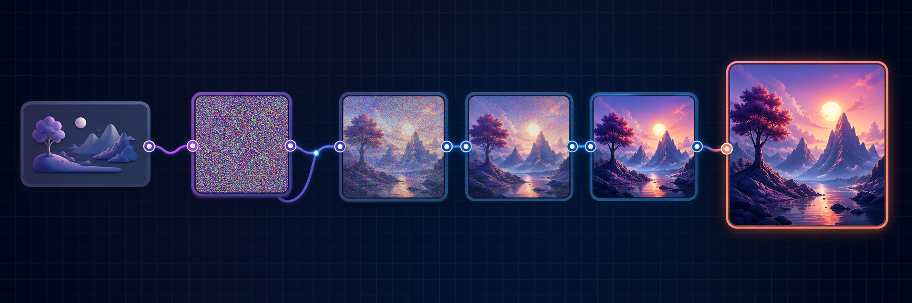

# Diffusion Research & ComfyUI Guide

> ComfyUI 노드의 작동 원리를 이해하고 실습으로 배우는 한국어 온라인 학습서입니다.

  

  

Stable Diffusion·SDXL·Flux의 원리와 ComfyUI 워크플로우를 한 흐름으로 연결합니다. **개념 → 노드 → 작은 실험 → 결과 해석 → 문제 해결** 순서로 스스로 워크플로우를 설계할 수 있게 돕는 것이 목표입니다.

## 원하는 방식으로 시작하기

| 가진 시간 | 할 일 | 얻는 결과 |
|---:|---|---|
| 5분 | [첫 이미지 생성](docs/00-getting-started/quick-start.md) | 기본 7노드 흐름 완성 |
| 30분 | [워크플로우 이해](docs/00-getting-started/workflow-basics.md) | MODEL·CLIP·LATENT·VAE 연결 이해 |
| 20분 | [프롬프트와 CLIP](docs/00-getting-started/prompt-basics.md) | 프롬프트가 조건으로 바뀌는 과정 이해 |
| 30분 | [첫 워크플로우 직접 만들기](docs/00-getting-started/first-workflow.md) | 빈 캔버스에서 스스로 워크플로우 제작 |
| 20분 | [저장과 재현](docs/00-getting-started/save-and-reproduce.md) | 같은 결과를 다시 만들 수 있게 남기기 |
| 필요할 때 | [문제 해결](docs/05-troubleshooting/README.md) | OOM·검은 이미지·노드 오류 진단 |

아직 ComfyUI가 없다면 [설치 가이드](docs/00-getting-started/installation.md)부터 시작하세요. 무엇을 읽어야 할지 모르겠다면 [전체 문서 지도](docs/README.md)에서 목표를 고르면 됩니다.

## 배우는 순서

**개념 이해 → 노드 연결 → 고정 Seed 실험 → 결과 비교 → 내 워크플로우에 적용**

- **눈으로 먼저 이해합니다.** 각 장에 흐름도, 화면 표시, 전후 비교를 단계적으로 추가합니다.
- **한 번에 변수 하나만 바꿉니다.** Seed를 고정하고 CFG·Steps·Sampler의 효과를 비교합니다.
- **복사보다 재현을 우선합니다.** 모델, 해상도, Seed, 핵심 파라미터와 예상 결과를 함께 기록합니다.
- **이론과 UI를 연결합니다.** 수식이나 용어를 실제 ComfyUI 노드와 대응시킵니다.
- **실패도 예제로 다룹니다.** 정상 결과뿐 아니라 자주 생기는 오류와 진단 순서를 제공합니다.

## 라이선스와 출처

저장소 문서의 이용 조건은 [LICENSE](LICENSE)를 확인하세요. 모델, 생성 이미지, 외부 워크플로우에는 각 제작자의 별도 라이선스가 적용될 수 있습니다. 상업적 이용 전 반드시 원 출처의 조건을 확인하세요.

질문과 오류 제보는 Issues를 이용해 주세요.
