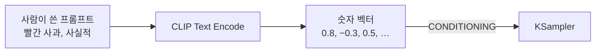
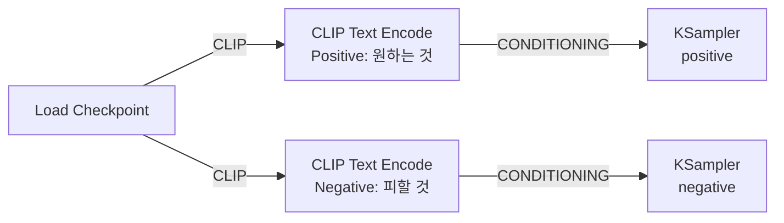

[홈](../README.md) · [시작하기](README.md) · [이전: 워크플로우 이해하기](workflow-basics.md) · [다음: 첫 워크플로우 만들기](first-workflow.md)

---

# 프롬프트와 CLIP 이해하기

> 사람이 쓴 문장이 어떻게 조건으로 바뀌어 KSampler에 전달되는지 이해합니다.

## 이 장에서 배우는 것

- CLIP이 프롬프트를 `CONDITIONING`으로 바꾸는 과정
- Positive와 Negative를 나누어 쓰는 법
- 결과가 흔들리지 않는 프롬프트 작성 구조
- FLUX.1에서 텍스트 인코더 구성이 달라지는 지점

<div class="guide-meta" markdown>
**대상** 이미지를 만들어 봤고 프롬프트를 의도대로 쓰고 싶은 사용자 · **사전 이해** [워크플로우 이해하기](workflow-basics.md)의 노드 연결 · **시간** 20분

**이럴 때 읽으세요** 같은 프롬프트인데 결과가 매번 크게 달라지거나, Negative에 무엇을 적어야 할지 모를 때.
</div>

## CLIP이 하는 일

**CLIP은 텍스트를 모델이 이해하는 형태로 바꾸는 번역기입니다.**



사람이 읽는 글자를 모델이 다룰 수 있는 숫자로 바꾸는 단계입니다. 이렇게 바뀐 형태를 `CONDITIONING`이라고 부릅니다.

### Positive와 Negative

| 구분 | 역할 | 예시 | 효과 |
|------|------|------|------|
| **Positive** | 원하는 것 | `a cat, blue sky, high quality` | 이런 요소를 이미지에 포함 |
| **Negative** | 원하지 않는 것 | `blurry, low quality, distorted` | 이런 요소를 이미지에서 제거 |

### ComfyUI 연결 구조

Load Checkpoint의 CLIP 출력 **하나**를 두 노드에 모두 연결합니다. 출력 포트 하나에서 선을 여러 개 뽑을 수 있습니다.



두 노드는 같은 CLIP을 쓰지만 KSampler의 **서로 다른 입력**으로 들어갑니다. 바꿔 꽂으면 원하는 것과 피할 것이 뒤집힙니다.

## 프롬프트 작성

### 좋은 구조

```text
[주제] + [스타일] + [품질] + [디테일]

예시:
a cute cat sitting on a window,
watercolor painting style,
high quality, detailed fur,
soft lighting, cozy atmosphere
```

### 피해야 하는 프롬프트

| 프롬프트 | 문제 |
|---|---|
| `cat` | 주제만 있고 스타일·품질·디테일이 없어 결과가 실행마다 크게 흔들립니다 |
| `a very very very beautiful cat` | 같은 단어를 반복해도 강조되지 않습니다. 강조는 [가중치 문법](../03-advanced-techniques/prompt-weighting.md) `(beautiful:1.2)`로 합니다 |
| `고양이, 예쁜` | 한국어는 인식되는 범위가 좁습니다 |

### 프롬프트 언어

CLIP은 영어 이미지-캡션 데이터로 학습됐기 때문에 영어 프롬프트를 가장 정확하게 해석합니다. 한국어·일본어는 인식되는 단어가 제한적이고, 같은 뜻이라도 결과가 크게 달라집니다. 프롬프트는 영어로 쓰세요.

Flux처럼 T5 계열 인코더를 함께 쓰는 모델은 긴 자연어 문장과 문맥을 비교적 잘 처리하지만, 이 경우에도 영어가 기준입니다.

### Negative Prompt 예시

| 용도 | 넣을 단어 |
|---|---|
| 기본 | `blurry, low quality, distorted, ugly, bad anatomy, extra limbs, watermark, text, signature` |
| 사진 스타일 | `cartoon, 3d render, illustration, painting, drawing` |
| 일러스트 | `photograph, realistic, photo` |

## FLUX.1의 텍스트 인코더

??? note "Flux를 쓸 때만 필요합니다 — 지금 건너뛰어도 됩니다"

    FLUX.1 모델은 **CLIP-L과 T5xxl 두 텍스트 인코더**를 사용합니다. T5는 CLIP이 아니며, `DualCLIPLoader`는 두 인코더를 함께 불러오는 ComfyUI 노드 이름입니다.

    CLIP-L은 시각적 연상을, T5xxl은 문맥과 뉘앙스를 맡습니다.

    **필요 파일**

    | 파일 | 크기 | 위치 |
    |---|---|---|
    | `clip_l.safetensors` | 약 1GB | `ComfyUI/models/text_encoders/` |
    | `t5xxl_fp8_e4m3fn.safetensors` | 약 5GB | `ComfyUI/models/text_encoders/` |

    **Dual CLIP Loader 설정**

    - `clip_name1`: t5xxl_fp8_e4m3fn.safetensors
    - `clip_name2`: clip_l.safetensors
    - `type`: flux

    자세한 구성은 [Flux 모델 가이드](../02-models/flux/README.md)에서 다룹니다.

## 완료 기준

네 가지를 모두 만족했다면 이 장을 끝냈습니다.

- CLIP이 프롬프트를 무엇으로 바꾸는지 한 문장으로 말할 수 있다.
- Positive와 Negative가 KSampler의 서로 다른 입력으로 간다는 점을 설명할 수 있다.
- 주제·스타일·품질·디테일을 나누어 프롬프트를 썼다.
- 같은 Seed에서 프롬프트만 바꿔 결과 차이를 확인했다.

## 다음 단계

- [첫 워크플로우 직접 만들기](first-workflow.md) — 참고 없이 구성하고 저장해 재현하기
- [프롬프트 가중치](../03-advanced-techniques/prompt-weighting.md) — 특정 단어의 강도 조절
- [CLIP과 Contrastive Learning](../01-core-concepts/clip-contrastive-learning.md) — CLIP이 그렇게 작동하는 이유

---

[홈](../README.md) · [시작하기](README.md) · [이전: 워크플로우 이해하기](workflow-basics.md) · [다음: 첫 워크플로우 만들기](first-workflow.md)
