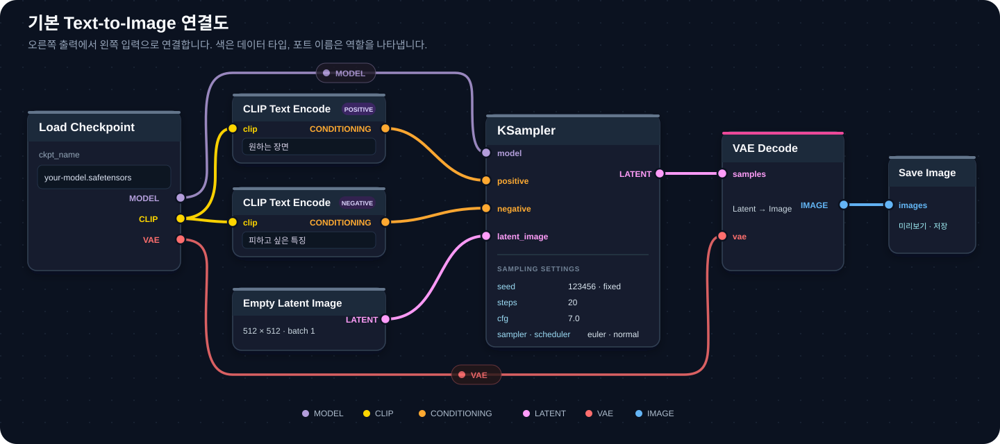

[홈](../README.md) · [시작하기](README.md) · [이전: 실행과 중단](run-and-stop.md) · [다음: 프롬프트와 CLIP](prompt-basics.md)

# 워크플로우 이해하기

> 각 노드의 역할과 데이터 흐름을 이해합니다

## 이 장에서 배우는 것

- 빠른 시작에서 연결한 노드들이 각각 무슨 일을 하는지
- 전체 흐름 다섯 단계와 각 노드의 입출력
- KSampler의 Steps·CFG·Sampler·Scheduler·Denoise가 결과를 어떻게 바꾸는지

**대상** 빠른 시작으로 이미지 한 장을 만들어 본 사용자 · **사전 이해** [5분 빠른 시작](quick-start.md)의 7노드 연결 · **시간** 30분

**이럴 때 읽으세요** 첫 이미지는 만들었고 각 노드의 의미가 궁금할 때. 프롬프트 쪽은 [다음 장](prompt-basics.md)에 있습니다.

## 전체 워크플로우 흐름도

ComfyUI의 이미지 생성 과정을 한눈에 파악합니다.

### 기본 워크플로우 (SD 1.5/SDXL)

1. **Load Checkpoint** — MODEL, CLIP, VAE 세 가지를 출력
2. **CLIP Text Encode** — Positive/Negative 프롬프트를 조건(Conditioning)으로 변환
3. **Empty Latent Image** — 빈 캔버스(Latent) 생성. 여기에는 아직 노이즈가 없고, 시작 노이즈는 KSampler가 `seed`로 만듭니다
4. **KSampler** — MODEL + 조건 + Latent를 받아 노이즈 제거
5. **VAE Decode** — 완성된 Latent를 이미지로 복원
6. **Save/Preview Image** — 결과 저장

### 단계별 세부 설명

| 단계 | 노드 | 역할 | 출력 |
|-----|------|------|------|
| **1단계** | Load Checkpoint | 모델 파일 로드 | MODEL, CLIP, VAE |
| **2단계** | CLIP Text Encode | 프롬프트 변환 | Conditioning (긍정/부정) |
| **3단계** | Empty Latent Image | 빈 캔버스 생성 | Latent (0으로 채워진 빈 상태) |
| **4단계** | KSampler | AI 이미지 생성 | Latent (완성) |
| **5단계** | VAE Decode | 압축 해제 | 일반 이미지 |
| **6단계** | Save Image | 저장 | 파일 출력 |

### 데이터 흐름 상세

기본 7노드 연결도. 이미지를 선택하면 원본 크기로 볼 수 있습니다.

연결에서 어긋나기 쉬운 세 지점입니다.

- **CLIP 한 갈래가 두 노드로** 나뉩니다. Positive와 Negative가 같은 텍스트 인코더를 사용합니다.
- **VAE는 KSampler를 거치지 않습니다.** Load Checkpoint에서 VAE Decode로 곧장 갑니다.
- **KSampler에 선으로 들어가는 것은 4개**입니다. 나머지 설정값은 노드 안에서 직접 넣습니다.

??? note "각 노드의 입출력 — 한눈에 대조"
    **Load Checkpoint** 출력:

    - MODEL — 노이즈 제거 엔진
    - CLIP — 텍스트 인코더
    - VAE — 압축/복원 도구

    **CLIP Text Encode** — 입력: CLIP, 텍스트 / 출력: Conditioning

    **KSampler**

    - 선으로 연결하는 입력 4개: MODEL, Positive Conditioning, Negative Conditioning, Latent Image
    - 노드 안에서 직접 입력하는 설정값: seed, steps, cfg, sampler_name, scheduler, denoise
    - 출력: Latent (생성 완료)

    **VAE Decode** — 입력: VAE, Latent / 출력: IMAGE

### Flux 워크플로우 차이점

- **SD 방식**: Load Checkpoint 하나로 MODEL + CLIP + VAE
- **FLUX.1 방식**: Load Diffusion Model(MODEL) + Load VAE(VAE) + Dual CLIP Loader(CLIP-L + T5xxl). FLUX.2 이후에는 해당 세대의 공식 로더 구성을 확인합니다.

### 연결 확인

- 모든 노드가 올바르게 연결되었나?
- CLIP Text Encode가 2개 (긍정/부정)인가?
- KSampler의 입력 4개(`model`·`positive`·`negative`·`latent_image`)가 모두 연결되었나?
- VAE Decode를 거쳤나?
- 최종적으로 Save Image가 연결되었나?

---

## KSampler — 이미지 생성 엔진

### 무엇을 하는 노드인가

**KSampler는 노이즈를 걷어내는 반복을 실행하는 노드입니다.**

무작위 노이즈에서 이미지가 만들어지는 과정을 이 노드의 설정값이 결정합니다.

### 작동 원리

KSampler는 `seed`로 시작 노이즈를 만들어 빈 Latent에 넣은 뒤, 스텝마다 노이즈를 조금씩 걷어냅니다. 마지막 스텝에서 노이즈가 거의 사라지면 이미지가 완성됩니다.

한 스텝에서 줄어드는 양은 균등하지 않습니다. Scheduler가 정한 일정에 따라 구간별로 다르게 배분됩니다. KSampler는 이 과정을 몇 번 반복할지, 조건을 얼마나 강하게 밀어붙일지를 결정합니다.

### 주요 설정 항목

| 항목 | 의미 | 범위 | 초보자 추천값 | 설명 |
|------|------|------|-------------|------|
| **Steps** | 이미지를 다듬는 횟수 | 10-150 | **20~30** | 많을수록 정밀하지만 느립니다. 모델별 시작값은 [빠른 시작](quick-start.md)의 표를 따릅니다 |
| **CFG Scale** | 프롬프트 준수 강도 | 1-20 | **7** | 높을수록 프롬프트 강제, 과도하면 부자연 |
| **Sampler** | 노이즈 제거 알고리즘 | 여러 종류 | **euler** 또는 **dpmpp_2m** | 결과 성향과 필요한 스텝 수가 달라집니다 |
| **Scheduler** | 노이즈를 줄이는 일정 | normal, karras 등 | **normal** | 스텝을 어느 구간에 몰아줄지 결정 |
| **Denoise** | 노이즈 제거 강도 | 0.0-1.0 | **1.0** | 1.0=완전 생성, <1.0=부분 수정 |

위 표의 추천값은 각 설정이 결과를 어떻게 바꾸는지 확인할 때 사용하는 기준입니다. **첫 장을 만들 때의 모델별 시작값은 [빠른 시작](quick-start.md#4-첫-실행값-넣기)의 표 하나만 따릅니다.** 이 문서와 뒤의 문서에 나오는 다른 범위는 결과를 다듬는 단계에서 사용하는 값입니다.

### CFG (Classifier-Free Guidance) 상세

CFG는 프롬프트를 얼마나 강하게 밀어붙일지 정하는 값입니다. 품질 점수가 아니라 **조건을 강제하는 정도**입니다.

| CFG | 결과 경향 |
|---|---|
| 1~3 | 프롬프트를 느슨하게 참고하고, 모델이 자유롭게 해석합니다 |
| 5~8 | 조건과 자연스러움이 균형을 이룹니다. 대부분의 시작값이 이 구간입니다 |
| 10 이상 | 프롬프트를 강하게 밀어붙입니다. 대비·채도가 과해지고 형태가 깨질 수 있습니다 |

cfg는 품질 점수가 아닙니다. 값을 올리면 프롬프트에 적은 조건을 더 강하게 반영하지만, 적지 않은 것을 만들어내지는 않습니다.

??? note "Sampler 종류 비교 — 성향과 추천 용도"
    | Sampler | 성향 | 특징 | 추천 용도 |
    |---|---|---|---|
    | **euler** | 결정적 | 가장 단순하고 예측 가능합니다. 같은 Seed·설정이면 항상 같은 결과 | 첫 실습, 변수 하나만 바꾸는 비교 |
    | **euler_a** | 확률적 | 스텝마다 노이즈를 다시 주입해 결과가 더 다양하게 흩어집니다 | 변형 탐색 |
    | **dpmpp_2m** | 결정적 | 이전 스텝의 계산을 재사용해 적은 스텝에서도 안정적입니다 | 최종 결과물 |
    | **dpmpp_2m** + `karras` | 결정적 | Scheduler가 저노이즈 구간에 스텝을 촘촘히 배분해 디테일이 살아납니다 | 디테일 중시 |
    | **ddim** | 결정적 | 초기 Diffusion 계열 샘플러입니다 | 다른 도구와 결과를 대조할 때 |

    !!! note "속도에 대한 오해"
        샘플러 대부분은 **한 스텝에 모델을 한 번 호출**하므로 스텝당 계산량이 비슷합니다. 체감 속도 차이는 "같은 품질에 도달하기까지 필요한 스텝 수"에서 생깁니다. 단, `heun`·`dpmpp_2s_ancestral`처럼 한 스텝에 모델을 두 번 호출하는 샘플러는 스텝당 시간이 약 2배입니다.

### Steps에 따른 결과 차이

| Steps | 결과 |
|---:|---|
| 10~15 | 빠르지만 형태가 덜 잡히고 흐릿합니다. 구도만 확인하는 용도 |
| 20~30 | 대부분의 작업에 충분합니다 |
| 40~50 | 미세한 디테일이 조금 더 살아나지만 시간이 비례해 늘어납니다 |
| 50 이상 | 눈에 보이는 개선이 거의 없습니다 |

스텝을 늘려도 개선이 멈추는 지점은 Sampler와 Scheduler 조합에 따라 다릅니다. Seed를 고정하고 Steps만 바꿔 직접 확인합니다.

### 한 변수 실험

다음 항목을 고정합니다.

- 모델과 정밀도
- 프롬프트
- Seed와 `control_after_generate=fixed`
- 해상도
- Sampler·Scheduler와 `cfg`

Steps만 바꿔 세 장을 만듭니다.

| 실행 | Steps | 관찰할 질문 |
|---|---:|---|
| A | 15 | 형태가 잡히지 않은 곳이 어디인가? |
| B | 25 | A에서 덜 잡힌 부분이 정리됐는가? |
| C | 40 | B와 다른 점을 찾을 수 있는가? |

B와 C의 차이가 보이지 않는다면 이 조합에서는 25에서 개선이 멈춘 것입니다.

### 이름의 K는 무엇인가

KSampler의 `K`는 **생성 장수와 관계가 없습니다.** Diffusion 샘플러 구현체인 **k-diffusion** 라이브러리에서 온 이름이며, KSampler에는 `K`라는 설정 항목 자체가 없습니다.

- 한 번에 여러 장을 만들려면 **Empty Latent Image**의 `batch_size`를 올립니다.
- 같은 설정에서 서로 다른 결과를 보려면 `seed`를 바꿉니다.

??? note "설정 예시 — 목적별 조합"
    | 목적 | steps | cfg | sampler_name | scheduler |
    |---|---:|---:|---|---|
    | 빠른 확인 | 20 | 7 | `euler` | `normal` |
    | 최종 결과물 | 30~40 | 7 | `dpmpp_2m` | `karras` |
    | 변형 탐색 | 25 | 4~5 | `euler_a` | `normal` |

    ComfyUI에서 Sampler와 Scheduler는 **별개 항목**입니다. 다른 도구에서 사용하는 `dpmpp_2m_karras` 같은 이름은 두 값을 붙인 표기이므로, ComfyUI에서는 `sampler_name`에 `dpmpp_2m`, `scheduler`에 `karras`를 각각 지정합니다.

### 기억할 기본값

- Steps는 20~30에서 시작한다
- CFG는 7 전후에서 시작한다
- Sampler는 euler로 시작하고, 익숙해지면 dpmpp_2m을 시도한다
- Denoise는 1.0으로 시작한다 (완전 생성)

### 주의사항

**이런 증상이 나타나면:**

| 문제 | 원인 | 해결 |
|------|------|------|
| 이미지가 과장됨 | CFG 너무 높음 | CFG 낮추기 (7 정도) |
| 이미지가 흐릿함 | Steps 너무 적음 | Steps 늘리기 (30+) |
| 너무 느림 | Steps 너무 많음 | Steps 줄이기 (20-30) |
| 프롬프트 무시 | CFG 너무 낮음 | CFG 높이기 (7-10) |

원하는 결과를 정한 뒤 **어떤 변수부터 만질지 고르는 순서**는 [첫 워크플로우 직접 만들기](first-workflow.md#목표를-정해-값-고르기)에 있습니다.

---

## 완료 기준

네 가지를 모두 만족했다면 이 장을 끝냈습니다.

- 7개 노드가 각각 무엇을 받아 무엇을 내보내는지 한 문장으로 말할 수 있다.
- KSampler의 Steps·CFG·Sampler·Scheduler·Denoise가 무엇을 바꾸는지 구분할 수 있다.
- CFG가 품질 점수가 아니라 조건을 밀어붙이는 강도라는 점을 설명할 수 있다.
- Seed를 고정하고 Steps만 바꾼 세 장을 비교해 개선이 멈추는 지점을 확인했다.

## 다음 단계

- [프롬프트와 CLIP 이해하기](prompt-basics.md) — 프롬프트가 조건으로 바뀌는 과정
- [첫 워크플로우 직접 만들기](first-workflow.md) — 참고 없이 구성하고 저장해 재현하기

---

[홈](../README.md) · [시작하기](README.md) · [이전: 실행과 중단](run-and-stop.md) · [다음: 프롬프트와 CLIP](prompt-basics.md)
