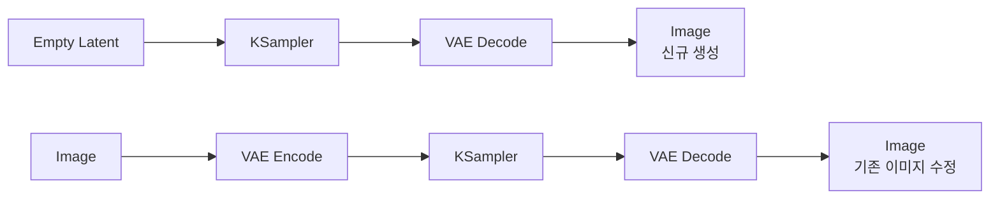
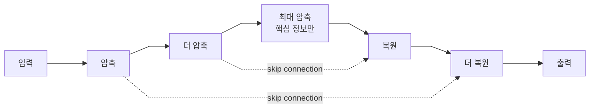

[홈](../README.md) · [문서 지도](../README.md)

# 핵심 개념 이해하기

> AI 이미지 생성의 기초 원리를 정리합니다. 용어는 처음 접하는 분도 이해할 수 있도록 풀어 쓰되, 설명은 정확성을 우선합니다.

## 이 장에서 배우는 것

- Latent는 AI가 이미지를 다루기 쉽게 압축한 상태이고, VAE가 이미지와 Latent 사이를 오갑니다.
- SD 계열은 UNet, Flux는 Transformer 구조를 씁니다. 포트 타입이 같아도 내부 구조는 다릅니다.

<div class="guide-meta" markdown>
**대상** AI 이미지 생성의 원리가 궁금한 입문자~중급자 · **사전 이해** 필요 없음 · **시간** 30분

**이럴 때 읽으세요** 노드를 연결할 줄은 알지만 왜 그렇게 연결하는지 궁금할 때.
</div>

## 1. Latent Image

Latent는 AI가 이미지를 다루기 쉽도록 압축한 상태입니다. 사람 눈에는 보이지 않습니다.

우리가 보는 1024×1024 이미지는 100만 개가 넘는 픽셀로 이루어집니다. AI가 이 픽셀을 직접 다루면 연산량이 지나치게 많습니다. 그래서 이미지를 작은 크기로 압축한 Latent 공간에서 작업한 뒤, 마지막에 다시 원본 크기로 복원합니다.

일반 이미지(완성된 요리, 크고 무거움)를 압축하면 Latent(요리 레시피, 작고 다루기 쉬움)이 되고, AI가 이 Latent을 다뤄 새 이미지(레시피대로 만든 새 요리)를 만듭니다.

압축의 효과는 처리량에서 드러납니다.

| 비교 | 일반 이미지 (512×512) | Latent (64×64) |
|------|----------------------|----------------|
| 처리할 데이터 | 786,432개 (512×512×3) | 16,384개 (64×64×4) |
| 데이터 양 | 기준 | 약 1/48 |
| 화면 표시 | 가능 | 불가능(압축 상태) |

다루는 데이터가 약 48분의 1로 줄어듭니다. 실제 생성 속도가 그만큼 빨라지는 것은 아니지만, 픽셀을 직접 다루는 방식과는 차원이 다른 계산량이라는 점이 중요합니다.

전체 생성 흐름에서 Latent의 위치는 다음과 같습니다.

1. **빈 Latent** — 0으로 채워진 빈 작업 공간. 아직 노이즈도 없습니다
2. **KSampler** — `seed`로 시작 노이즈를 만들어 넣고, 그 노이즈를 이미지로 바꾸는 과정
3. **완성된 Latent** — 아직 압축 상태라 보이지 않음
4. **VAE Decode** — 압축 해제
5. **일반 이미지** — 이제 볼 수 있음

정리하면, Latent는 보이지 않는 압축 공간이며 AI 연산에 최적화된 형태입니다. 결과를 보려면 반드시 VAE Decode로 압축을 풀어야 하고, Empty Latent는 아무것도 없는 시작점입니다.

## 2. VAE

VAE(Variational AutoEncoder)는 이미지와 Latent를 서로 변환하는 도구입니다.

| 역할 | 노드 | 입력 | 출력 | 사용 시점 |
|------|------|------|------|-----------|
| 압축 | VAE Encode | 일반 이미지 | Latent | 기존 이미지를 수정할 때 |
| 복원 | VAE Decode | Latent | 일반 이미지 | 결과를 확인할 때(필수) |

신규 생성과 기존 이미지 수정에서 VAE가 놓이는 위치가 다릅니다.



차이는 **앞쪽에 VAE Encode가 있느냐** 하나뿐입니다. 기존 이미지를 고칠 때는 그 이미지를 먼저 Latent으로 압축해야 KSampler가 다룰 수 있습니다.

KSampler는 Latent(압축 상태)를 출력하므로 반드시 VAE Decode를 거쳐야 합니다. Save Image는 `IMAGE`만 받기 때문에, 빠뜨리면 **선 자체가 연결되지 않습니다.**

- 연결 불가: KSampler → Save Image (타입이 다릅니다)
- 올바름: KSampler → VAE Decode → Save Image

Latent를 ZIP 파일, VAE Decode를 압축 해제로 생각하면 이해하기 쉽습니다. 압축을 풀어야 폴더 안을 볼 수 있습니다.

## 3. 아키텍처 비교: UNet vs Transformer

AI 이미지 생성 모델의 근본 구조는 크게 두 가지입니다. UNet은 주변을 중심으로 처리하고, Transformer는 전체를 한 번에 참조합니다.

| 항목 | UNet (SD 1.5/SDXL) | Transformer (Flux) |
|------|--------------------|--------------------|
| 기반 | CNN | Self-Attention |
| 처리 방식 | 지역적(주변 위주) | 전역적(전체 동시 참조) |
| 텍스트 이해 | 보통 | 우수 |
| 구도 파악 | 약함 | 강함 |
| 속도 | 빠름 | 느림 |
| 메모리 | 적음 | 많음 |

### UNet — 부분을 중심으로 처리

UNet은 이미지를 단계적으로 압축했다가 다시 복원하는 U자 형태의 구조입니다. 주변 픽셀을 중심으로 처리하므로 국소적인 디테일에 강한 대신, 전체 맥락 파악은 상대적으로 약합니다.



이름이 U자인 이유는 내려갔다가 다시 올라오는 모양 때문입니다. 점선은 **skip connection**으로, 압축하며 잃은 세부를 복원 단계에 다시 전달합니다.

예를 들어 "왼쪽에 빨간 사과, 오른쪽에 초록 사과" 같은 프롬프트에서 색과 대상은 잘 그리지만 좌우 위치를 혼동할 때가 있습니다.

### Transformer — 전체를 동시에 참조

Transformer는 이미지를 여러 패치로 나누고 모든 패치가 서로 정보를 교환합니다. 전체 맥락을 함께 보기 때문에 프롬프트 이해력과 위치 관계 표현이 뛰어납니다.

```
이미지를 패치로 분할한 뒤 모든 패치가 상호 참조

[패치1] ↔ [패치2] ↔ [패치3]
   ↕         ↕         ↕
[패치4] ↔ [패치5] ↔ [패치6]
```

같은 "왼쪽/오른쪽" 프롬프트에서 Transformer 기반 모델(Flux)은 위치 관계를 더 정확하게 반영합니다.

## 4. 모델 구성 요소

ComfyUI에서 자주 혼동되는 세 개념입니다.

| 개념 | 정체 | 비유 | 파일/위치 |
|------|------|------|-----------|
| UNet/DiT | AI 생성 엔진의 구조 | 자동차 엔진 설계 | 개념(파일 아님) |
| Checkpoint | 학습된 모델 파일 | 완성된 자동차 | .safetensors |
| Load 노드 | 파일을 메모리에 적재 | 시동 | ComfyUI 노드 |

**UNet/DiT**는 노이즈를 제거해 이미지를 만드는 엔진의 구조입니다. 모델의 "뇌 구조"에 해당하며 사용자가 직접 다루지 않습니다.

**Checkpoint**는 학습이 끝난 전체 모델 파일입니다. 내부에 UNet/DiT(엔진), VAE(압축 도구), Text Encoder(텍스트 이해)가 함께 들어 있습니다. 예: `realisticVision_v60.safetensors`.

**Load 노드**는 이 파일을 RAM/VRAM에 올려 워크플로우에서 쓸 수 있게 합니다.

하드디스크의 Checkpoint 파일을 Load 노드가 메모리에 적재하면, UNet/DiT(엔진)·VAE(압축 도구)·Text Encoder(텍스트 이해)로 나뉘어 워크플로우에서 쓰입니다.

SD 계열과 Flux는 이 구성 요소를 다루는 방식이 다릅니다.

| 구분 | SD 1.5/SDXL | Flux |
|------|-------------|------|
| 로드 노드 | Load Checkpoint | Load Diffusion Model |
| 폴더 | models/checkpoints/ | models/diffusion_models/ |
| 구조 | UNet | DiT (Transformer) |
| 파일 구성 | 통합(한 파일) | 분리(여러 파일) |

## 5. 자주 묻는 질문

**Steps를 100으로 올리면 더 좋아지나요?**
30 이상에서는 큰 차이가 없습니다. 20은 빠르지만 품질이 약간 떨어지고, 30 부근이 품질과 속도의 균형점입니다. 50을 넘으면 시간만 늘어납니다.

**VAE Decode를 하지 않으면 어떻게 되나요?**
KSampler의 출력을 Save Image에 바로 연결할 수 없습니다. Latent는 압축 상태이므로 반드시 VAE Decode로 풀어야 이미지가 됩니다.

**Flux가 SD보다 항상 나은가요?**
목적에 따라 다릅니다. 복잡한 프롬프트, 정확한 위치 지정, 높은 품질이 필요하면 Flux가 유리합니다. 빠른 생성이나 낮은 사양, 간단한 이미지에는 SD가 더 실용적입니다.

**Empty Latent 크기는 어떻게 정하나요?**
모델의 학습 해상도에 맞춥니다. 학습 크기와 크게 다르면 품질이 떨어집니다.

| 모델 | 권장 크기 |
|------|-----------|
| SD 1.5 | 512×512 |
| SDXL | 1024×1024 |
| Flux | 1024×1024 |

## 완료 기준

네 가지를 모두 만족했다면 이 장을 끝냈습니다.

- Latent가 무엇이고 왜 쓰는지 한 문장으로 말할 수 있다.
- VAE Encode와 VAE Decode를 각각 언제 쓰는지 구분할 수 있다.
- UNet과 Transformer가 무엇이 다른지 설명할 수 있다.
- Checkpoint 안에 무엇이 들어 있는지, Flux는 왜 파일이 나뉘는지 말할 수 있다.

## 다음 단계

- [디노이징 프로세스](./denoising-process.md) — 노이즈가 이미지가 되는 단계
- [02. 모델 가이드](../02-models/README.md) — 모델 계열별 사용법
- [04. 워크플로우 예제](../04-workflows/README.md) — 적용 사례
- [용어 사전](../GLOSSARY.md) — 용어 정의

---

[홈](../README.md) · [시작하기](../00-getting-started/README.md)
