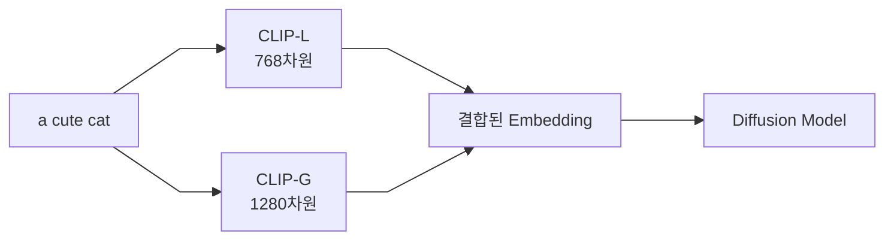
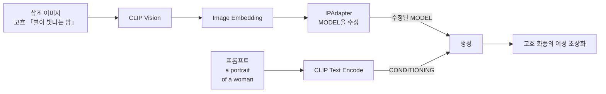

[홈](../README.md) · [문서 지도](../README.md)

---

# CLIP과 Contrastive Learning

> CLIP 모델의 학습 원리와 AI 이미지 생성에서의 역할

## 이 장에서 배우는 것

- CLIP은 방대한 이미지-캡션 쌍을 대조 학습해 "고양이"라는 단어와 고양이 이미지를 같은 의미 공간에 놓습니다. 그래서 프롬프트가 이미지의 방향을 정할 수 있습니다.
- SDXL은 CLIP 계열 인코더 두 개를 사용하고, FLUX.1은 CLIP-L과 T5를 함께 사용합니다. T5는 CLIP이 아니며 이후 FLUX 세대의 구성은 다릅니다.
- AI가 텍스트와 이미지를 연결하는 원리 (Contrastive Learning)
- CLIP이 "고양이"라는 단어를 이해하는 방식
- SDXL과 Flux에서 사용되는 듀얼 CLIP 시스템의 차이

<div class="guide-meta" markdown>
**대상** 프롬프트가 이미지로 변환되는 원리가 궁금한 중급자 · **사전 이해** 없음 (기본적인 AI 개념 있으면 좋음) · **시간** 15-20분

**이럴 때 읽으세요** 프롬프트가 왜/어떻게 작동하는지, 모델별 텍스트 인코더 구성이 궁금할 때.
</div>

??? note "1. Contrastive Learning이란? — 배경 원리"
    ### 핵심 개념

    **Contrastive Learning = 레이블 없이 "비교"로 학습하는 방법**

    전통적인 AI 학습은 "이건 고양이야"라고 정답을 알려주지만,
    Contrastive Learning은 "이 두 개는 비슷해/달라"만으로 학습합니다.

    ### 작동 방식

    ```mermaid
    %%{init: {"flowchart": {"curve": "linear", "nodeSpacing": 55, "rankSpacing": 70, "padding": 12}, "themeVariables": {"fontSize": "14px"}} }%%
    graph LR
        A[입력 데이터] --> B[Embedding Network] --> C[임베딩 공간]
        C -->|짝으로 묶인 것| D["거리를 좁힘"]
        C -->|짝이 아닌 것| E["거리를 벌림"]
    ```

    ### 비유로 이해하기

    **전통적 학습:**
    ```
    선생님: "이건 사과야" (레이블 제공)
    학생:   "알겠습니다" (암기)
    ```

    **Contrastive Learning:**
    ```
    선생님: "이 두 과일은 같은 종류야 / 이 두 개는 다른 종류야"
    학생:   "비슷한 걸 가까이, 다른 걸 멀리 배치하며 배우기"
    ```

    ### 장점

    | 장점 | 설명 | 실용적 이점 |
    |------|------|------------|
    | **사람이 붙인 정답 레이블 불필요** | 인터넷의 (이미지, 캡션) 쌍을 그대로 사용 | 대규모 데이터셋 활용 가능 |
    | **일반화 능력** | 본질적 특징 학습 | 새로운 데이터에 강함 |
    | **표현력** | 고품질 임베딩 생성 | 다양한 Task 활용 가능 |

    ---

??? note "2. CLIP의 학습 과정 — 배경 원리"
    ### CLIP이란?

    **CLIP = Contrastive Language-Image Pre-training**

    Text와 Image 간의 관계성을 Contrastive Learning으로 모델링한 연구입니다.

    ### CLIP 학습 과정

    학습 데이터는 (이미지, 텍스트) 쌍 4억 개입니다.

    - Image와 Text를 각각 Image Encoder / Text Encoder로 임베딩
    - 두 임베딩의 유사도(Similarity)를 계산
    - 같은 쌍은 가깝게, 다른 쌍은 멀게 학습

    ### 학습 목표

    | 짝 | 학습 목표 | 예시 |
    |------|------|------|
    | **맞는 짝** | 둘 사이의 거리를 **좁힙니다** | 고양이 사진 ↔ `a cat` |
    | **틀린 짝** | 둘 사이의 거리를 **벌립니다** | 고양이 사진 ↔ `a dog` |

    ### 왜 강력한가?

    **4억 개의 (이미지, 텍스트) 쌍으로 학습**
    - 다양한 개념 이해
    - 언어의 뉘앙스 파악
    - 시각적 특징 추출 능력

    ---

## 3. CLIP Vision의 역할

### CLIP Vision이란?

**CLIP의 Image Encoder 부분 = CLIP Vision**

이미지를 "의미 있는 벡터"로 변환하는 역할을 합니다.

### CLIP 구조

| 모듈 | 입력 | 출력 | 차원 |
|------|------|------|------|
| **CLIP Text** | 텍스트 프롬프트 | Text Embedding | 768-dim |
| **CLIP Vision** | 참조 이미지 | Image Embedding | 768-dim |

### Image-to-Image 생성에서의 역할


### 핵심 역할

**"이미지를 고차원 의미 공간으로 매핑"**

픽셀 값을 그대로 넘기는 것이 아니라, 무엇이 담긴 이미지인지를 나타내는 특징 벡터로 바꿉니다.

**예시:** 고양이 사진을 CLIP Vision에 넣으면 `[0.2, −0.5, 0.8, …]` 같은 숫자 묶음이 나옵니다. 이 숫자들이 "고양이"라는 개념을 담고 있습니다.

---

## 4. 듀얼 CLIP 시스템

### 왜 2개의 CLIP을 사용하나?

일부 고급 모델(SDXL, Flux)은 **2개의 서로 다른 CLIP 모델**을 동시에 사용합니다.

### 듀얼 CLIP의 필요성

| 이유 | 설명 | 효과 |
|------|------|------|
| **다양한 해석** | 서로 다른 CLIP은 텍스트를 약간 다르게 해석 | 더 풍부한 의미 표현 |
| **균형 잡힌 결과** | 한 모델의 편향 상쇄 | 안정적인 생성 |
| **특화된 기능 결합** | 구조 이해 vs 스타일 표현 | 완성도 높은 결과 |
| **세밀한 제어** | 두 CLIP 간 가중치 조절 | 정밀한 제어 가능 |

### SDXL의 듀얼 CLIP 예시

같은 프롬프트가 두 인코더로 **동시에** 들어갔다가 하나로 합쳐집니다.



**역할 분담:**
- **CLIP-L**: 기본적인 개념 파악
- **CLIP-G**: 세밀한 디테일과 스타일

### 실전 효과

**단일 CLIP:**
"a red apple on a blue table" → 때때로 색상 혼동 가능

**듀얼 CLIP:**
"a red apple on a blue table" → 색상과 위치가 어긋날 확률이 줄어듦

듀얼 CLIP이 색상·위치를 항상 정확히 반영한다는 뜻은 아닙니다. SDXL에서도 색이 뒤바뀌는 경우는 흔히 나타납니다. 확실한 위치·구조 제어가 필요하면 [ControlNet](../03-advanced-techniques/controlnet/controlnet-architecture.md)을 씁니다.

---

## 5. 실전 활용

### IPAdapter에서의 CLIP Vision

**IPAdapter = CLIP Vision을 활용한 이미지 기반 제어**

참조 이미지와 프롬프트는 **서로 다른 경로**로 들어가 생성 단계에서 만납니다.



참조 이미지는 **무엇을 그릴지**가 아니라 **어떤 느낌으로 그릴지**를 정합니다. 그림의 내용은 프롬프트가 정합니다. 두 입력이 서로 다른 라인을 타는 이유입니다.

### CLIP Vision 모델 종류

| 모델 | 입력 해상도 | 용도 |
|------|--------|------|
| **OpenCLIP ViT-H-14** | 224×224 | SD 1.5/SDXL IPAdapter |
| **OpenCLIP ViT-BigG-14** | 224×224 | SDXL IPAdapter (고품질) |
| **SigLIP-so400m-patch14-384** | 384×384 | Flux IPAdapter/Redux |

파일 크기는 배포처와 정밀도에 따라 크게 다릅니다(같은 모델도 수백 MB에서 수 GB까지). 내려받기 전 해당 페이지의 실제 파일 크기를 확인하세요. 이름 안의 `so400m`은 파일 용량이 아니라 파라미터 수(약 4억)를 뜻합니다.

### Image Classification 활용

**프롬프트 형식:**

| 형식 | 결과 |
|------|------|
| 단어만: `dog` | 보통 |
| 문장으로: `a photo of a dog` | 더 정확 |

CLIP이 (이미지, 문장) 쌍으로 학습됐기 때문에, 단어 하나보다 문장 형태가 잘 맞습니다.

### 실전 팁

**1. 참조 이미지는 선명한 것으로**
흐릿하거나 해상도가 낮은 이미지는 특징이 뭉개져 원하는 방향이 잘 전달되지 않습니다.

**2. 사용하는 어댑터가 요구하는 인코더 확인**
어댑터마다 함께 쓸 CLIP Vision 모델이 정해져 있습니다. 배포 페이지가 지정한 파일을 그대로 받으세요.

**3. 참조 이미지와 프롬프트를 같은 방향으로**
수채화 참조 이미지에 `watercolor painting style` 프롬프트를 함께 쓰면 두 조건이 서로를 보강합니다. 반대 방향이면 서로를 상쇄합니다.

---

## 완료 기준

네 가지를 모두 만족했다면 이 장을 끝냈습니다.

- Contrastive Learning이 "짝을 맞추는 방식"으로 학습한다는 점을 설명할 수 있다.
- CLIP이 무엇의 약자이고 무엇과 무엇을 연결하는지 말할 수 있다.
- CLIP Text와 CLIP Vision이 각각 어디에 쓰이는지 구분할 수 있다.
- 모델 계열마다 텍스트 인코더 구성이 다르다는 점과, T5가 CLIP이 아니라는 점을 설명할 수 있다.

## 다음 단계

- [디노이징 프로세스](./denoising-process.md) — 이미지 생성 메커니즘
- [IPAdapter](../03-advanced-techniques/controlnet/ipadapter.md) — CLIP Vision 실전 활용
- [Flux 실전 구현](../02-models/flux/flux-practical.md#style-transfer-methods) — 참조 이미지로 변형 만들기

---

[홈](../README.md) · [문서 지도](../README.md)
