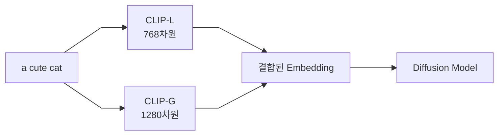
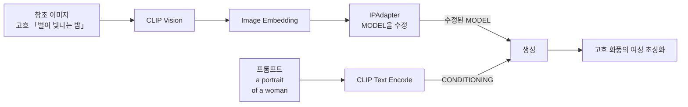

[문서 지도](../README.md)

# CLIP과 Contrastive Learning

> CLIP 모델의 학습 원리와 AI 이미지 생성에서의 역할

## 이 장에서 배우는 것

- CLIP(Contrastive Language-Image Pre-training)은 방대한 이미지-캡션 쌍을 대조 학습해 "고양이"라는 단어와 고양이 이미지를 같은 의미 공간에 놓습니다. 그래서 프롬프트가 이미지의 방향을 정할 수 있습니다.
- SDXL은 CLIP 계열 인코더 두 개를 사용하고, FLUX.1은 CLIP-L과 T5를 함께 사용합니다. T5는 CLIP이 아니며 이후 FLUX 세대의 구성은 다릅니다.
- CLIP의 이미지 쪽 절반인 CLIP Vision은 참조 이미지를 벡터로 바꿔 IPAdapter와 Redux에 넘깁니다.

<div class="guide-meta" markdown>
**대상** 프롬프트가 이미지로 변환되는 원리가 궁금한 중급자 · **사전 이해** 없음 (기본적인 AI 개념 있으면 좋음) · **시간** 15~20분

**이럴 때 읽으세요** 프롬프트가 왜/어떻게 작동하는지, 모델별 텍스트 인코더 구성이 궁금할 때.
</div>

??? note "Contrastive Learning이란? — 배경 원리"
    Contrastive Learning은 정답 레이블 없이 "이 둘이 짝인가"만으로 학습합니다.
    "이건 고양이야"라고 알려주는 대신, 짝인 것은 임베딩 공간에서 가깝게, 짝이 아닌 것은 멀게 배치하도록 학습합니다.

    ```mermaid
    %%{init: {"flowchart": {"curve": "linear", "nodeSpacing": 55, "rankSpacing": 70, "padding": 12}, "themeVariables": {"fontSize": "14px"}} }%%
    graph LR
        A[입력 데이터] --> B[Embedding Network] --> C[임베딩 공간]
        C -->|짝으로 묶인 것| D["거리를 좁힘"]
        C -->|짝이 아닌 것| E["거리를 벌림"]
    ```

    ### 학습 신호의 차이

    | 방식 | 학습 데이터에 필요한 것 | 모델이 배우는 것 |
    |---|---|---|
    | 지도 학습 | 사람이 붙인 정답 레이블 (`사과`) | 입력 → 레이블 대응 |
    | Contrastive Learning | 짝인지 아닌지만 (이미지, 캡션) | 짝은 가깝게, 아닌 것은 멀게 배치하는 임베딩 |

    이 방식이 CLIP에 사용된 이유는 데이터 때문입니다. 사람이 레이블을 붙일 필요가 없어, 인터넷에 이미 있는 (이미지, 캡션) 쌍을 그대로 학습에 넣을 수 있습니다.

??? note "CLIP의 학습 과정 — 배경 원리"
    CLIP은 위 방식을 텍스트와 이미지에 적용한 모델입니다. 학습 데이터는 (이미지, 텍스트) 쌍 4억 개입니다.

    - Image와 Text를 각각 Image Encoder / Text Encoder로 임베딩
    - 두 임베딩의 유사도(Similarity)를 계산
    - 같은 쌍은 가깝게, 다른 쌍은 멀게 학습

    | 짝 | 학습 목표 | 예시 |
    |------|------|------|
    | **맞는 짝** | 둘 사이의 거리를 **좁힙니다** | 고양이 사진 ↔ `a cat` |
    | **틀린 짝** | 둘 사이의 거리를 **벌립니다** | 고양이 사진 ↔ `a dog` |

    프롬프트가 이미지 생성의 방향을 정할 수 있는 근거가 여기에 있습니다. 학습이 끝나면 `a cat`이라는 문장의 임베딩이 고양이 이미지의 임베딩 근처에 놓입니다.

## 1. CLIP Vision의 역할

### CLIP Vision이란?

CLIP의 Image Encoder 쪽 절반을 CLIP Vision이라고 부릅니다.

이미지를 "의미 있는 벡터"로 변환하는 역할을 합니다.

### CLIP 구조

| 모듈 | 입력 | 출력 | 차원 |
|------|------|------|------|
| **CLIP Text** | 텍스트 프롬프트 | Text Embedding | 768-dim |
| **CLIP Vision** | 참조 이미지 | Image Embedding | 768-dim |

### Image-to-Image 생성에서의 역할


### 넘어가는 것은 픽셀이 아닙니다

CLIP Vision은 픽셀 값을 그대로 넘기지 않고, 무엇이 담긴 이미지인지를 나타내는 특징 벡터로 바꿔 넘깁니다.

**예시:** 고양이 사진을 CLIP Vision에 넣으면 `[0.2, −0.5, 0.8, …]` 같은 숫자 묶음이 나옵니다. 이 숫자들이 "고양이"라는 개념을 담고 있습니다.

---

## 2. 듀얼 CLIP 시스템

SDXL과 FLUX.1은 텍스트 인코더를 **두 개** 사용합니다. 같은 프롬프트가 두 인코더에 각각 들어가고, 두 결과가 합쳐져 하나의 `CONDITIONING`이 됩니다.

| 모델 | 인코더 1 | 인코더 2 |
|---|---|---|
| SDXL | CLIP-L (768차원) | CLIP-G (1280차원) |
| FLUX.1 | CLIP-L (768차원) | T5XXL (4096차원) — CLIP이 아닙니다 |

두 인코더는 차원과 학습 데이터가 달라 같은 문장을 다르게 인코딩합니다. 어느 쪽 비중을 얼마로 할지는 ComfyUI 기본 워크플로우에서 조절하지 않습니다.

### SDXL의 듀얼 CLIP 예시

같은 프롬프트가 두 인코더로 **동시에** 들어갔다가 하나로 합쳐집니다.



**역할 분담:**
- **CLIP-L**: 기본적인 개념 파악
- **CLIP-G**: 세밀한 디테일과 스타일

### 실전 효과

듀얼 CLIP이 `a red apple on a blue table` 같은 프롬프트의 색상·위치를 항상 정확히 반영한다는 뜻은 아닙니다. SDXL에서도 색이 뒤바뀌는 경우는 흔히 나타납니다. 확실한 위치·구조 제어가 필요하면 [ControlNet](../03-advanced-techniques/controlnet/controlnet-architecture.md)을 사용합니다.

---

## 3. 실전 활용

### IPAdapter에서의 CLIP Vision

IPAdapter는 CLIP Vision으로 인코딩한 참조 이미지로 MODEL을 수정합니다.

참조 이미지와 프롬프트는 **서로 다른 경로**로 들어가 생성 단계에서 만납니다.



참조 이미지는 **무엇을 그릴지**가 아니라 **어떤 느낌으로 그릴지**를 정합니다. 그림의 내용은 프롬프트가 정합니다. 두 입력이 서로 다른 라인을 타는 이유입니다.

### CLIP Vision 모델 종류

| 모델 | 입력 해상도 | 용도 |
|------|--------|------|
| **OpenCLIP ViT-H-14** | 224×224 | SD 1.5/SDXL IPAdapter |
| **OpenCLIP ViT-BigG-14** | 224×224 | SDXL IPAdapter (고품질) |
| **SigLIP-so400m-patch14-384** | 384×384 | Flux IPAdapter/Redux |

파일 크기는 배포처와 정밀도에 따라 크게 다릅니다(같은 모델도 수백 MB에서 수 GB까지). 내려받기 전 해당 페이지의 실제 파일 크기를 확인하세요. 이름 안의 `so400m`은 파일 용량이 아니라 파라미터 수(약 4억)를 뜻합니다.

### 이미지 분류에서의 활용

**프롬프트 형식:**

| 형식 | 결과 |
|------|------|
| 단어만: `dog` | 보통 |
| 문장으로: `a photo of a dog` | 더 정확 |

CLIP은 (이미지, 문장) 쌍으로 학습됐습니다. 학습 데이터와 같은 형태인 문장이 단어 하나보다 정확하게 매칭됩니다.

### 적용할 때 확인할 것

**1. 참조 이미지는 선명한 것으로**
흐릿하거나 해상도가 낮은 이미지는 특징이 뭉개져 원하는 방향이 잘 전달되지 않습니다.

**2. 사용하는 어댑터가 요구하는 인코더 확인**
어댑터마다 함께 사용할 CLIP Vision 모델이 정해져 있습니다. 배포 페이지가 지정한 파일을 그대로 받으세요.

**3. 참조 이미지와 프롬프트를 같은 방향으로**
수채화 참조 이미지에 `watercolor painting style` 프롬프트를 함께 사용하면 두 조건이 서로를 보강합니다. 반대 방향이면 서로를 상쇄합니다.

---

## 완료 기준

네 가지를 모두 만족했다면 이 장을 끝냈습니다.

- Contrastive Learning이 "짝을 대조하는 방식"으로 학습한다는 점을 설명할 수 있다.
- CLIP이 무엇의 약자이고 무엇과 무엇을 연결하는지 말할 수 있다.
- CLIP Text와 CLIP Vision이 각각 어디에 사용되는지 구분할 수 있다.
- 모델 계열마다 텍스트 인코더 구성이 다르다는 점과, T5가 CLIP이 아니라는 점을 설명할 수 있다.

## 다음 단계

- [디노이징 프로세스](./denoising-process.md) — 이미지 생성 메커니즘
- [IPAdapter](../03-advanced-techniques/controlnet/ipadapter.md) — CLIP Vision 실전 활용
- [FLUX.1 작업 선택과 Redux 실습](../02-models/flux/flux-practical.md#style-transfer-methods) — 참조 이미지로 변형 만들기

---

[문서 지도](../README.md)
