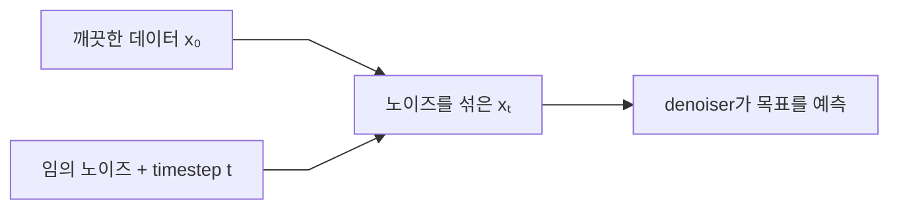
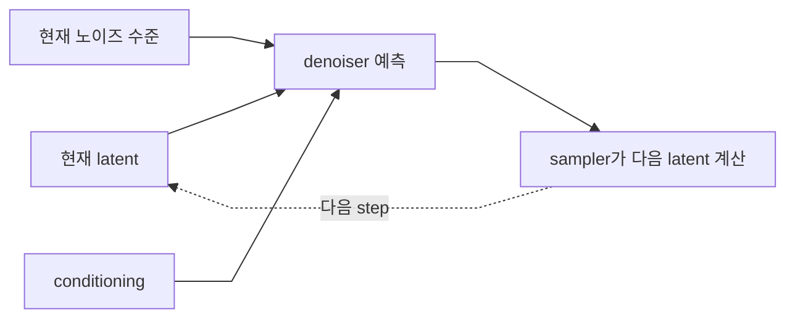

[홈](../README.md) · [문서 지도](../README.md)

# Denoising Process - 이미지 생성의 핵심

> 학습의 timestep과 ComfyUI 추론 steps를 구분하고, sampler와 scheduler가 latent를 갱신하는 과정을 이해합니다.

!!! note "이 문서는 한 단계 깊은 내용입니다"
    sigma, prediction type 같은 용어가 나옵니다. 이미지를 만들기 위해 지금 꼭 필요한 내용은 아니므로, 어렵게 느껴지면 [핵심 개념](./README.md)이나 [워크플로우 이해하기](../00-getting-started/workflow-basics.md)로 돌아갔다가 나중에 다시 오세요. Steps·Sampler·Scheduler를 **쓰는 방법**만 필요하다면 [Sampler 비교](../03-advanced-techniques/samplers/sampler-comparison.md)가 더 알맞습니다.

## 이 장에서 배우는 것

- 학습에서는 깨끗한 데이터에 임의의 노이즈 수준을 적용한 샘플을 만들고, 모델이 노이즈·속도·흐름 등 모델별 목표를 예측하도록 훈련합니다.
- 생성에서는 학습 timestep 전체를 그대로 1000번 실행하지 않습니다. 선택한 steps와 sigma schedule을 따라 여러 번 모델을 호출해 latent를 갱신합니다.
- SD 1.5·SDXL은 U-Net 계열, FLUX.1은 Transformer 계열 denoiser를 사용합니다. latent 채널과 예측 목표도 모델 계열마다 다릅니다.
- ComfyUI에서 **sampler는 갱신 방법**, **scheduler는 노이즈 수준을 배치하는 시간표**입니다.

<div class="guide-meta" markdown>
**대상** KSampler의 Steps·Sampler·Scheduler·Denoise가 왜 필요한지 알고 싶은 사용자 · **사전 이해** Latent와 VAE의 기본 역할 · **시간** 20분
</div>

## 1. 학습에서는 무엇을 배우나

깨끗한 이미지 또는 그 이미지의 latent를 `x₀`라고 하겠습니다. 학습용 노이즈 일정에는 매우 많은 timestep이 정의될 수 있지만, 매 학습 예제마다 1부터 끝까지 순서대로 노이즈를 더할 필요는 없습니다.

일반적인 학습 단계는 다음과 같습니다.

1. 깨끗한 데이터 `x₀`를 준비합니다.
2. 임의의 timestep `t`를 고릅니다.
3. 정해진 수식으로 해당 시점의 noisy sample `xₜ`를 직접 만듭니다.
4. 모델에 `xₜ`, `t`, 텍스트 조건 등을 입력합니다.
5. 모델이 예측한 값과 정답 목표를 비교해 학습합니다.



### 무엇을 예측하나

모델이 항상 원본 이미지나 노이즈 `ε`만 예측하는 것은 아닙니다.

| 모델·학습 방식 | 가능한 예측 목표 |
|---|---|
| 전통적인 DDPM 계열 | 노이즈 `ε` |
| 일부 Stable Diffusion 계열 | `v` prediction 등 |
| Rectified Flow·Flow Matching 계열 | 상태가 이동할 속도 또는 흐름 |

입문 단계에서는 “현재 noisy 상태를 다음의 더 정돈된 상태로 옮기는 방향을 예측한다”라고 기억하면 충분합니다.

### 학습 timestep과 UI steps는 다르다

- **학습 timestep:** 모델이 다양한 노이즈 수준을 배우기 위해 정의한 연속 또는 이산 시간 좌표
- **추론 steps:** 생성할 때 sampler가 실제로 모델을 호출하는 횟수에 가까운 사용자 설정

학습에 1000개의 시간 좌표가 정의되어 있어도 생성에서 반드시 1000번 모델을 호출하는 것은 아닙니다.

## 2. 생성에서는 무엇을 반복하나

Text-to-Image는 Seed로 만든 노이즈와 빈 latent 공간에서 시작합니다. 각 추론 step에서 다음 과정이 반복됩니다.



마지막에는 VAE가 정돈된 latent를 픽셀 이미지로 디코딩합니다.

### 왜 여러 단계가 필요한가

노이즈가 많은 초반에는 큰 구조와 구도가 정해지고, 노이즈가 적은 후반에는 작은 형태와 질감이 다듬어지는 경향이 있습니다. 다만 어느 구간이 어떤 역할을 얼마나 담당하는지는 모델·sampler·scheduler·prompt에 따라 달라집니다.

### Steps를 늘리면 항상 좋아지나

아닙니다. 모델과 sampler가 충분히 수렴한 뒤에는 steps를 더 늘려도 차이가 작거나 오히려 결과가 달라질 수 있습니다. 빠른 모델이나 step-distilled 모델은 제작자가 권장한 적은 steps를 사용해야 합니다.

## 3. U-Net과 Transformer 구분

ComfyUI는 서로 다른 내부 구조를 모두 `MODEL` 타입으로 연결합니다. 포트 타입이 같다고 내부 구조까지 같은 것은 아닙니다.

| 계열 | 대표 denoiser | 일반적인 latent 특징 | 주의 |
|---|---|---|---|
| SD 1.5·SDXL | U-Net 계열 | 전통적인 VAE 기준 보통 4채널, 이미지의 1/8 공간 크기 | 모델별 prediction type이 다를 수 있음 |
| FLUX.1 | Transformer 계열 | VAE 출력은 16채널이며 모델 입력 전에 패치·토큰 형태로 재배열 | U-Net 구조 설명을 그대로 적용하면 안 됨 |
| FLUX.2 등 이후 모델 | 세대별 전용 Transformer·VAE | 채널 수와 축소 비율이 세대마다 다름 | 해당 모델 공식 워크플로우 확인 |

따라서 `128×128×16` 같은 한 가지 shape를 모든 모델의 latent 또는 U-Net 입력으로 외우지 않습니다. 해상도 1024×1024라는 사실만으로 내부 shape가 같아지는 것도 아닙니다.

### SD 계열 U-Net의 역할

U-Net은 여러 해상도의 특징을 처리하고 skip connection으로 앞뒤 특징을 연결합니다. 텍스트 conditioning을 cross-attention 등에 사용해 현재 latent의 갱신 방향을 예측합니다.

### FLUX 계열 Transformer의 역할

FLUX.1은 이미지와 텍스트 표현을 Transformer 블록에서 처리하는 rectified-flow 계열 모델입니다. UI에서는 노이즈를 정돈하는 작업처럼 보이지만, 내부 목표와 구조를 U-Net의 `ε` 예측으로 동일시하면 안 됩니다.

## 4. Sampler와 Scheduler 구분

ComfyUI의 KSampler에는 `sampler_name`과 `scheduler`가 별도 항목으로 있습니다.

### Sampler — 다음 상태를 계산하는 방법

| 예 | 의미 |
|---|---|
| `euler` | Euler 방법으로 다음 latent 계산 |
| `euler_ancestral` | 확률적 노이즈를 포함하는 ancestral 계열 |
| `dpmpp_2m` | 이전 예측을 활용하는 다단계 DPM++ 계열 |
| `ddim` | DDIM 방식의 갱신 규칙 |

### Scheduler — sigma를 배치하는 시간표

| 예 | 의미 |
|---|---|
| `normal` | 모델의 기본 sampling 설정에 따른 배치 |
| `karras` | Karras 형태로 sigma 구간 배치 |
| `exponential` | 지수 형태로 배치 |
| `simple` | 모델 sampling 설정에서 단순한 간격으로 선택 |

다른 도구에서 `DPM++ 2M Karras`라고 묶어 부르는 조합은 ComfyUI에서 보통 다음처럼 나눕니다.

```text
sampler_name: dpmpp_2m
scheduler:    karras
```

### Denoise

KSampler의 `denoise`는 전체 sigma schedule 중 어느 정도를 사용할지 정하는 편의 설정입니다.

- Text-to-Image의 Empty Latent에서는 보통 `1.0`
- Image-to-Image에서는 원본 구조를 남기기 위해 1.0보다 낮은 값부터 비교

`denoise=0.5`가 픽셀의 정확히 50%를 바꾸거나 결과가 절반만 달라진다는 뜻은 아닙니다.

??? note "5. 텍스트 Conditioning — 더 깊이 볼 때"
    텍스트 인코더는 프롬프트를 모델이 사용할 수 있는 conditioning으로 바꿉니다.

    ```mermaid
    %%{init: {"flowchart": {"curve": "linear", "nodeSpacing": 55, "rankSpacing": 70, "padding": 12}, "themeVariables": {"fontSize": "14px"}} }%%
    graph LR
        P[Prompt] --> TE[Text Encoder] --> C[CONDITIONING]
        C --> M["각 sampling step에서<br/>MODEL에 전달"]
    ```

    SD 1.5·SDXL은 CLIP 계열 텍스트 인코더를 사용합니다. FLUX.1은 CLIP-L과 T5를 함께 사용하지만 T5는 CLIP이 아닙니다. FLUX.2 등 이후 세대는 다른 텍스트 인코더를 사용할 수 있습니다.

    Conditioning은 결과의 방향을 제시하지만, 텍스트 토큰이 이미지의 특정 좌표에 물체를 직접 배치한다고 단정할 수는 없습니다. 배치와 관계는 모델의 attention과 학습된 표현이 여러 단계에서 함께 형성합니다.

??? note "6. ComfyUI 파이프라인과 한 변수 실험"
    ### 기본 Text-to-Image

    

    `Empty Latent Image`는 크기에 맞는 0으로 채운 latent 공간을 만듭니다. KSampler가 Seed를 사용해 시작 노이즈를 준비합니다.

    ### 한 변수 실험 — Steps

    모델·프롬프트·Seed·해상도·sampler·scheduler를 고정하고 steps만 바꿉니다. 일반 SD/SDXL 모델의 예시이며 빠른 distilled 모델에는 해당 모델 권장값을 사용합니다.

    | 실행 | steps | 관찰 질문 |
    |---|---:|---|
    | A | 12 | 큰 형태가 충분히 잡혔는가? |
    | B | 20 | A에서 어떤 세부가 달라졌는가? |
    | C | 30 | 추가 시간만큼 눈에 띄는 개선이 있는가? |

    ### 기록할 항목

    ```text
    모델과 버전:
    prediction/sampling 계열(알면):
    Seed:
    steps:
    sampler_name:
    scheduler:
    denoise:
    해상도:
    관찰:
    ```

??? question "자주 묻는 질문"
    **Q. 학습이 1000 timestep이면 생성도 1000 steps가 가장 정확한가요?**  
    A. 아닙니다. 학습 시간 좌표와 추론에서 선택한 모델 호출 단계는 다른 개념입니다. 모델 제작자의 권장 steps를 기준으로 비교하세요.

    **Q. Euler와 DDIM은 Scheduler인가요?**  
    A. ComfyUI KSampler에서는 sampler입니다. `normal`, `karras`, `simple` 등이 scheduler 항목입니다.

    **Q. 모든 모델이 노이즈 ε를 예측하나요?**  
    A. 아닙니다. 모델에 따라 ε, v, flow/velocity 등 학습 목표가 다릅니다.

    **Q. denoise 0.5면 원본이 정확히 절반 남나요?**  
    A. 아닙니다. 전체 sampling 구간의 일부를 사용한다는 뜻이며 시각적 변화량은 모델과 입력에 따라 다릅니다.

## 완료 기준

- 학습 timestep과 추론 steps의 차이를 설명할 수 있다.
- SD/SDXL U-Net과 FLUX Transformer를 구분할 수 있다.
- sampler와 scheduler 예시를 각각 두 개 이상 말할 수 있다.
- denoise가 픽셀 변경 비율이 아님을 설명할 수 있다.

## 다음 단계

- [핵심 개념](./README.md) — Latent·VAE·모델 구성 요소
- [KSampler·KSamplerAdvanced·SamplerCustomAdvanced](../03-advanced-techniques/samplers/ksampler-vs-advanced.md) — 실제 노드 구분
- [Sampler 비교](../03-advanced-techniques/samplers/sampler-comparison.md) — 같은 조건에서 sampler 비교
- [Flux 모델 가이드](../02-models/flux/README.md) — FLUX.1과 이후 세대 구분

---

[홈](../README.md) · [문서 지도](../README.md)
