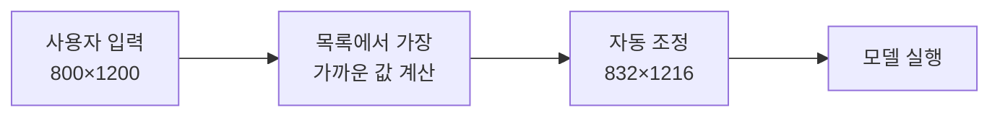

[문서 지도](../../README.md)

# SDXL 해상도 최적화

> SDXL 모델의 최적 해상도 설정과 품질 관리

## 이 장에서 배우는 것

- SDXL은 정해진 해상도 목록(버킷)으로 학습됐습니다. 목록 밖 크기에서는 구도가 무너지거나 같은 대상이 반복됩니다.
- 1:1은 1024×1024이며, 다른 비율도 총 픽셀이 약 1메가픽셀인 공식 버킷을 사용합니다. 원하는 비율은 가장 가까운 버킷으로 조정하세요.

**대상** SDXL 모델로 고품질 이미지를 생성하고 싶은 사용자 · **사전 이해** 해상도(Width/Height) 설정법 · **시간** 10분

**이럴 때 읽으세요** 16:9·21:9 등 다양한 비율을 품질 저하 없이 뽑고 싶을 때.

## 1. SDXL 해상도 개념

### 해상도 목록의 의미

SDXL은 1024×1024를 중심으로 한 해상도 목록에서 학습됐습니다.

### SD 1.5 vs SDXL 비교

| 모델 | Native 해상도 | 학습 데이터 | 권장 범위 |
|------|--------------|------------|-----------|
| **SD 1.5** | 512×512 | 512px 중심 | 448~768px |
| **SDXL** | 1024×1024 | 1024px 중심 | 640~1536px (버킷 목록 안) |

### 왜 특정 해상도인가?

목록을 벗어난 크기도 실행은 됩니다. 다만 구도가 왜곡되거나 같은 대상이 화면 안에서 반복되는 결과가 나옵니다.

### 왜 8의 배수인가?

`Empty Latent Image`의 `width`와 `height`는 8씩만 움직입니다. 이 노드가 만드는 Latent의 크기가 `height // 8 × width // 8`이기 때문입니다. 픽셀 1024는 Latent 128이 되고, 8로 나누어떨어지지 않는 값은 소수점이 잘려 지정한 픽셀 크기와 어긋납니다.

| 노드 | 기본값 | 증감 단위 | 사용 모델 |
|---|---|---|---|
| `Empty Latent Image` | 512×512 | 8 | SD 1.5·SDXL |
| `EmptySD3LatentImage` | 1024×1024 | 16 | SD3·Flux |

Flux 계열에서 사용하는 `EmptySD3LatentImage`는 16씩 움직입니다. 두 노드의 단위가 다르므로, 같은 해상도 목록을 두 모델에 그대로 옮겨 사용할 때는 16으로 나누어떨어지는지 확인합니다.

---

## 2. Nearest SDXL Resolution

!!! warning "기본 기능이 아니라 커스텀 노드입니다"
    `Nearest SDXL Resolution`은 ComfyUI에 기본 포함된 기능이 **아닙니다.** 커뮤니티 커스텀 노드로 제공되며, ComfyUI-Manager에서 해당 노드를 설치해야 목록에 나타납니다. 설치 방법과 주의사항은 [설치 가이드의 커스텀 노드 관리자](../../00-getting-started/installation.md#커스텀-노드-관리자와-안전한-확장-설치)를 먼저 읽으세요.

    설치하지 않고도 같은 결과를 얻습니다. 아래 [권장 해상도 목록](#3-권장-해상도-목록)에서 값을 골라 `Empty Latent Image`에 직접 입력하면 같은 결과를 얻습니다. **입문 단계에서는 직접 입력을 권장합니다.**

### 기능 개요

`Nearest SDXL Resolution`은 지정한 해상도를 SDXL의 권장 해상도 중 가장 가까운 값으로 변환하는 노드입니다.

### 작동 방식

### 목적

| 목적 | 설명 |
|------|------|
| **품질 보장** | 모델의 학습 해상도와 일치 |
| **아티팩트 방지** | 비표준 해상도의 왜곡 최소화 |
| **계산 효율** | 최적화된 해상도로 빠른 처리 |

### 사용 여부

| 상황 | 선택 |
|---|---|
| 임의의 크기를 자주 시도하며 버킷으로 자동 정렬하고 싶다 | 노드를 추가해 사용 |
| 목록에서 값을 골라 직접 입력한다 | **입문 단계 권장.** 노드가 필요 없습니다 |
| 결과물의 픽셀 크기를 정확히 지정해야 한다 | 반드시 직접 입력 |

---

## 3. 권장 해상도 목록

### SDXL 권장 해상도

#### 정사각형

| 해상도 | 비율 | 용도 |
|--------|------|------|
| **1024×1024** | 1:1 | 프로필, SNS, 표준 |

#### 가로 (Landscape)

| 해상도 | 비율 | 용도 |
|--------|------|------|
| **1152×896** | 1.29:1 | 풍경, 와이드 |
| **1216×832** | 1.46:1 | 영화, 파노라마 |
| **1344×768** | 1.75:1 | 초와이드 |
| **1536×640** | 2.4:1 | 배너 |

#### 세로 (Portrait)

| 해상도 | 비율 | 용도 |
|--------|------|------|
| **896×1152** | 0.78:1 | 인물, 세로 |
| **832×1216** | 0.68:1 | 전신, 타이트 |
| **768×1344** | 0.57:1 | 모바일 세로 |
| **640×1536** | 0.42:1 | 스토리 형식 |

### 해상도 자동 조정 예시

| 입력 해상도 | → | 조정된 해상도 | 차이 |
|-------------|---|--------------|------|
| 800×1200 | → | 832×1216 | 소폭 조정 |
| 1000×1000 | → | 1024×1024 | 미세 조정 |
| 1280×720 | → | 1344×768 | 가까운 비율 |
| 512×512 | → | 1024×1024 | 한 변이 2배, 픽셀 수는 4배 |

---

## 4. 실전 활용 가이드

### 용도별 권장 설정

| 용도 | 권장 해상도 | 고른 이유 |
|---|---|---|
| SNS 포스트 | 1024×1024 | 정사각형 표준. 가장 안정적이고 빠릅니다 |
| 데스크톱 배경 | 1344×768 | 목록 안에서 16:9(1.78)에 가장 가까움(1.75) |
| 모바일 세로 | 768×1344 | 목록 안에서 9:16(0.56)에 가장 가까움(0.57) |
| 인쇄물(A4 비율) | 896×1152 또는 832×1216 | A4 세로 비율(0.71)에 근접 |

모바일 세로에서 인물을 크게 담고 싶다면 덜 길쭉한 `832×1216`이 낫습니다. 인쇄물은 버킷 안의 크기로 생성한 뒤 [업스케일](../../04-workflows/upscale-and-batch.md#1-고해상도-업스케일)로 최종 인쇄 크기까지 키웁니다. 처음부터 버킷 밖 큰 크기로 만들면 구조가 무너집니다.

---

### 주의사항

**1. 해상도가 예상보다 크게 바뀔 수 있습니다**

`500×800`(세로 비율 0.63)은 `832×1216`과 `768×1344` 사이에 놓여 어느 쪽으로 갈지 예측하기 어렵습니다. 어느 쪽이든 픽셀 수는 약 2.5배로 늘어 생성 시간과 VRAM 사용량이 함께 증가합니다. 비율이 중요하다면 목록을 보고 직접 고르세요.

**2. 정확한 픽셀 크기가 필요하다면 자동 조정을 사용하지 않습니다**

인쇄 규격이나 후처리 파이프라인처럼 최종 크기가 정해진 작업에서는 값을 직접 넣습니다. 다만 목록을 벗어나면 품질 저하는 감수해야 합니다.

**3. 큰 결과물은 업스케일로 만듭니다**

처음부터 큰 해상도로 생성하는 대신, 권장 해상도로 만든 뒤 업스케일하면 품질을 유지하면서 원하는 크기를 얻을 수 있습니다.

---

### 크기를 정하는 순서

**1. 비율을 먼저 정합니다**

| 원하는 비율 | 사용할 해상도 |
|---|---|
| 1:1 | 1024×1024 |
| 16:9 | 1344×768 |
| 9:16 | 768×1344 |
| 4:3 | 1152×896 |

**2. 권장 해상도로 먼저 테스트합니다**

한 장을 만들어 구도를 확인한 뒤, 필요하면 업스케일로 크기를 키웁니다.

### 한 변수 실험

다음 항목을 고정합니다.

- 모델과 정밀도
- 프롬프트
- Seed와 `control_after_generate=fixed`
- Sampler·Scheduler·Steps

`Empty Latent Image`의 `width`·`height`만 바꿔 세 장을 만듭니다.

| 실행 | width×height | 관찰할 질문 |
|---|---:|---|
| A | 1024×1024 | 대상이 몇 개이고 구도는 어떤가? |
| B | 512×512 | 형태가 왜곡되는가? |
| C | 1536×1536 | 같은 대상이 둘 이상 나타나는가? |

해상도를 바꾸면 Latent 크기가 함께 바뀌므로 Seed를 고정해도 같은 그림은 나오지 않습니다.

---

## 완료 기준

네 가지를 모두 만족했다면 이 장을 끝냈습니다.

- SDXL이 버킷 목록으로 학습됐다는 점과, 목록을 벗어나면 무엇이 나빠지는지 설명할 수 있다.
- 원하는 비율에 맞는 버킷을 목록에서 고를 수 있다.
- `Nearest SDXL Resolution`이 커스텀 노드이며 없어도 된다는 점을 안다.
- 같은 프롬프트를 목록 안 해상도와 목록 밖 해상도로 각각 생성해 차이를 확인했다.

## 다음 단계

- [SD 1.5 / SDXL 모델 가이드](./README.md) — 모델 선택 기준
- [Flux 모델 가이드](../flux/README.md) — 다음 세대 모델
- [워크플로우 예제](../../04-workflows/upscale-and-batch.md#1-고해상도-업스케일) — 업스케일로 해상도 확대

---

[문서 지도](../../README.md)
