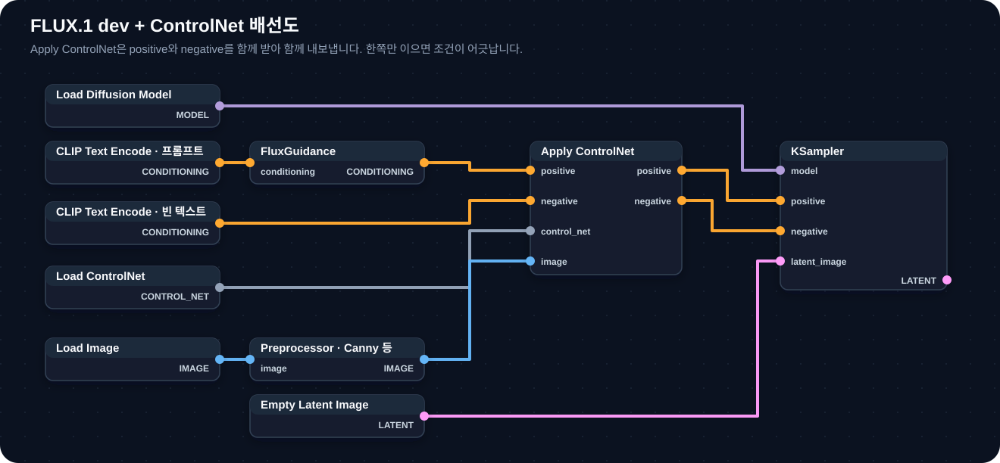

[홈](../../README.md) · [문서 지도](../../README.md)

# ControlNet 연결과 조절

> 전처리 결과를 실제 워크플로우에 연결하고, 텍스트 조건과 구조 조건의 균형을 잡습니다.

[← ControlNet 아키텍처](controlnet-architecture.md)

## 이 장에서 배우는 것

- MODEL·CONDITIONING·LATENT 세 흐름이 각각 어디로 가는지
- `Apply ControlNet`이 positive·negative를 함께 받아 함께 내보낸다는 점
- guidance와 strength를 따로 비교해 균형을 잡는 방법
- Inpainting과 함께 쓸 때의 연결 순서

<div class="guide-meta" markdown>
**대상** ControlNet의 원리를 읽었고 실제로 연결하려는 사용자 · **사전 이해** [ControlNet 아키텍처](controlnet-architecture.md)의 구조와 전처리기 · **시간** 20분

**이럴 때 읽으세요** 노드는 넣었는데 구조가 반영되지 않거나, 어떤 값을 먼저 만질지 모를 때.
</div>

## Pipeline 연결과 조절 규칙

### 먼저 확인할 세 데이터 흐름

| 흐름 | 포함하는 것 | 마지막 연결 |
|---|---|---|
| `MODEL` | 기본 모델, LoRA, IPAdapter 등 모델 수정 | Sampler의 `model` |
| `CONDITIONING` | positive·negative 텍스트 조건, Flux guidance, ControlNet 조건 | Sampler의 `positive`·`negative` 또는 Guider |
| `LATENT` | 빈 latent 또는 인페인팅할 latent | Sampler의 `latent_image` |

노드를 화면의 왼쪽이나 오른쪽에 놓는 위치보다 각 출력 타입이 최종 Sampler까지 이어지는지가 중요합니다.

### FLUX.1 dev + ControlNet 연결 예

다음은 KSampler를 사용하는 기본 연결입니다. 현재 `Apply ControlNet`은 positive와 negative conditioning을 모두 입력받아 두 conditioning을 다시 출력합니다.

<div class="workflow-figure" markdown>

[](../../assets/images/controlnet-wiring.svg)

<p class="workflow-figure__caption">연결선은 직각으로 꺾여 노드를 가로지르지 않습니다. 이미지를 선택하면 원본 크기로 볼 수 있습니다.</p>

</div>

`Apply ControlNet`은 positive와 negative를 **둘 다 받아 둘 다 내보냅니다.** 한쪽만 KSampler로 이으면 조건이 어긋납니다.

`CLIPTextEncodeFlux`의 guidance 입력을 사용하는 경우 별도 FluxGuidance 없이 그 출력 conditioning을 `Apply ControlNet.positive`에 연결합니다. ControlNet에 따라 전용 적용 노드나 필수 VAE 입력이 있을 수 있으므로 모델 제공자의 워크플로우를 우선합니다.

### 핵심 규칙

| 규칙 | 설명 |
|:-----|:-----|
| **1** | KSampler에는 최종 MODEL·positive/negative CONDITIONING·LATENT를 연결합니다 |
| **2** | `Apply ControlNet`의 positive·negative 출력을 모두 다음 노드 또는 Sampler에 전달합니다 |
| **3** | InpaintModelConditioning을 사용하면 positive·negative conditioning과 latent 출력을 함께 사용합니다 |
| **4** | 텍스트 조건은 guidance, 구조 조건은 ControlNet strength와 start/end를 각각 비교합니다 |
| **5** | 한 번에 변수 하나만 바꾸고 Seed를 고정해 비교합니다 |
| **6** | 수정된 MODEL·CONDITIONING 출력이 중간에서 끊기지 않았는지 확인합니다 |

### 텍스트와 구조 균형 조절

기본 연결은 하나로 유지하고 값만 바꿉니다. 먼저 ControlNet 모델 제공자가 제시한 strength를 기준값으로 기록합니다.

| 실험 | 고정할 값 | 바꿀 값 | 관찰할 것 |
|---|---|---|---|
| A | ControlNet strength·start/end | Flux guidance | 프롬프트 요소, 과장, 질감 변화 |
| B | guidance·start/end | ControlNet strength | 포즈·윤곽 일치, 경직, 아티팩트 |
| C | guidance·strength | `end_percent` | 후반 세부 묘사와 구조 유지 |

ControlNet마다 학습 방식과 권장 범위가 달라 범용 “표준 strength”는 없습니다. 제공자가 권장값을 제시하지 않았다면 낮은 값부터 작은 간격으로 올리며 비교합니다.

??? note "Inpainting과 함께 쓸 때의 연결 순서"
    1. Text Encode에서 positive·negative conditioning을 준비합니다.
    2. 두 conditioning과 전처리 이미지를 `Apply ControlNet`에 연결합니다.
    3. `Apply ControlNet`의 positive·negative 출력을 `InpaintModelConditioning`에 전달합니다.
    4. 원본 이미지·마스크·VAE를 `InpaintModelConditioning`에 연결합니다.
    5. 여기서 나온 positive·negative conditioning과 latent를 KSampler에 함께 연결합니다.

    이 구성은 마스크 영역을 편집하면서 ControlNet 구조 조건을 함께 전달하는 한 가지 기본 흐름입니다. 사용 모델이 전용 inpaint 또는 ControlNet 적용 노드를 제공하면 그 워크플로우를 따릅니다.

??? note "전체 스택 — 모든 컴포넌트를 합쳤을 때"
    ```mermaid
    %%{init: {"flowchart": {"curve": "linear", "nodeSpacing": 55, "rankSpacing": 70, "padding": 12}, "themeVariables": {"fontSize": "14px"}} }%%
    graph LR
        TE["Text Encode<br/>positive / negative"] --> FG["FluxGuidance<br/>positive 경로"]
        FG --> AC["Apply ControlNet"]
        AC --> IMC["InpaintModelConditioning"]
        IMG["원본 이미지<br/>+ 마스크 + VAE"] --> IMC
        IMC -->|positive / negative| KS[KSampler]
        IMC -->|latent| KS
    ```

    이 표기는 데이터가 흐르는 한 가지 읽기 순서입니다. `Text > Control > Inpaint` 같은 고정 계층을 뜻하지 않습니다. 각 출력이 KSampler까지 전달되는지와 각 강도·적용 구간을 따로 확인합니다.

    ---

    ??? warning "4. 트러블슈팅 — 에러와 품질 문제"
        ### 일반 에러

        | 에러 메시지 | 원인 | 해결 방법 |
        |:-----------|:-----|:---------|
        | `IPAdapter model not found` | 모델 파일 누락/잘못된 경로 | **1단계:** Base 모델 확인<br>**2단계:** 올바른 IPAdapter 다운로드<br>• SD1.5: `ip-adapter-plus_sd15.safetensors`<br>• SDXL: `ip-adapter-plus_sdxl_vit-h.safetensors`<br>• Flux: `flux-ip-adapter.safetensors`<br>**3단계:** `ComfyUI/models/ipadapter/` 배치<br>**4단계:** 파일명 대소문자 확인<br>**5단계:** ComfyUI 재시작 |
        | `SDXL IPAdapter incompatible with Flux` | 아키텍처 불일치 (UNet vs DiT) | XLabs 또는 InstantX에서 Flux 전용 모델 다운로드 |
        | `Out of memory (OOM)` | VRAM 초과 | **즉시 해결:** FP16→FP8 전환<br>**추가 최적화:**<br>• `t5xxl_fp16` → `t5xxl_fp8`<br>• GGUF Q6/Q5 사용<br>• 해상도 감소<br>• [실행 플래그 조정](../../05-troubleshooting/README.md#2-메모리-관련-문제) |

        ### 품질 문제

        | 증상 | 원인 분석 | 해결 방법 |
        |:-----|:---------|:---------|
        | ControlNet이 구조를 거의 반영하지 않음 | 모델 비호환, 잘못된 전처리, conditioning 연결 누락, strength·적용 구간 문제 | **모델 확인:** FLUX와 ControlNet 호환성 확인<br>**전처리 확인:** Preprocessor 출력 미리보기<br>**연결 확인:** positive·negative 출력이 Sampler까지 이어지는지 확인<br>**값 비교:** 제공자 권장값에서 strength만 작은 폭으로 조절 |
        | IPAdapter 스타일 약함 | 가중치 부족 또는 참조 이미지 품질 저하 | **가중치 증가:** `weight` 0.8 → 1.2<br>**이미지 품질:** 고해상도 참조 이미지 사용<br>**모델 확인:** CLIP Vision 로드 검증<br>**preset 변경:** 통합 로더 노드의 preset을 더 강한 항목으로 |
        | Inpainting 경계 이음새 | 마스크 경계 딱딱함 | **핵심 해결:** `DifferentialDiffusion` 노드를 MODEL 라인에 추가<br>**마스크 처리:** Feather/Blur 증가<br>**그라데이션:** 0.0~1.0 그라데이션 마스크<br>**품질:** steps 증가 |

        ---

## 빠른 참조

??? note "기억법 테이블·파라미터 치트시트 펼치기"
    ### 기억법 테이블

    | 개념 | 기억법 | 설명 |
    |:-----|:------|:-----|
    | **Pipeline 연결** | "구조를 만들고, 강도를 조절한다" | 전처리 결과·conditioning·latent가 Sampler까지 이어지는지 확인 |
    | **IPAdapter vs ControlNet** | "느낌 vs 형태" | IPAdapter = 분위기, ControlNet = 구조 |
    | **Differential Diffusion** | "검정-회색-흰색 = 유지-중간-교체" | 마스크 밝기에 따라 픽셀별 denoise 강도가 달라짐 |
    | **Redux vs IPAdapter** | "Conditioning vs Model" | Redux는 conditioning 수정, IPAdapter는 model 수정 |
    | **LoRA vs IPAdapter** | "학습 vs 실시간" | LoRA = 사전 학습, IPAdapter = 이미지 참조 |

    ### 파라미터 치트시트

    **FluxGuidance와 ControlNet 비교 기록:**
    ```
    FluxGuidance:          3.5에서 비교 시작
    ControlNet 모델:
    제공자 권장 strength:
    실험 strength:
    start_percent:         0.0
    end_percent:           1.0
    Seed / Steps / Sampler:
    ```

    `start_percent=0.0`, `end_percent=1.0`은 전체 구간 적용을 뜻합니다. 텍스트·구조 균형은 연결을 완성한 뒤 위 값을 한 번에 하나씩 바꿔 찾습니다.

    **IPAdapter:**
    ```
    은은함:     weight 0.5-0.7
    표준:      weight 0.8-1.0
    강함:      weight 1.2-1.5
    ```

    **Differential Diffusion:**
    ```
    마스크 값:   해당 픽셀에 적용되는 denoise 강도
    0.0 (검정)  원본 유지
    0.5 (회색)  중간 — 원본과 새 생성이 섞임
    1.0 (흰색)  전체 구간 적용 — 새로 생성
    ```
    회색 0.5가 "픽셀의 절반이 바뀐다"는 뜻은 아닙니다. 그 픽셀이 샘플링 구간의 일부에서만 갱신된다는 의미입니다.

---

## 추가 자료

??? note "공식 문서·모델 다운로드 링크 펼치기"
    ### 공식 문서

    | 카테고리 | 리소스 | URL |
    |:---------|:-------|:----|
    | **ComfyUI** | 공식 예제 및 가이드 | https://comfyanonymous.github.io/ComfyUI_examples/ |
    | **Flux** | Black Forest Labs 공식 도구 | https://github.com/black-forest-labs/flux |
    | **IPAdapter** | IPAdapter Plus 확장 | https://github.com/cubiq/ComfyUI_IPAdapter_plus |
    | **ControlNet** | ControlNet 원본 구현 | https://github.com/lllyasviel/ControlNet |

    ### 모델 다운로드

    #### IPAdapter 모델

    | 모델 유형 | 다운로드 링크 |
    |:---------|:-------------|
    | **SD 1.5 / SDXL** | https://huggingface.co/h94/IP-Adapter |
    | **Flux (XLabs)** | https://huggingface.co/XLabs-AI/flux-ip-adapter-v2 |
    | **Flux (InstantX)** | https://huggingface.co/InstantX/FLUX.1-dev-IP-Adapter |

    #### Flux 모델

    | 모델 | 다운로드 링크 |
    |:-----|:-------------|
    | **Flux.1 Dev (공식)** | https://huggingface.co/black-forest-labs/FLUX.1-dev |
    | **Flux.1 Fill** | https://huggingface.co/black-forest-labs/FLUX.1-Fill-dev |
    | **Flux Dev FP8 (Kijai)** | https://huggingface.co/Kijai/flux-fp8 |
    | **Flux GGUF (City96)** | https://huggingface.co/city96/FLUX.1-dev-gguf |

    #### ControlNet 모델

    | 제공자 | 다운로드 링크 |
    |:-------|:-------------|
    | **Flux ControlNet (XLabs)** | https://huggingface.co/XLabs-AI/flux-controlnet-collections |
    | **Flux ControlNet (InstantX)** | https://huggingface.co/InstantX/FLUX.1-dev-Controlnet-Union |

---

## 완료 기준

세 가지를 모두 만족했다면 이 장을 끝냈습니다.

- `Apply ControlNet`의 positive·negative 출력을 모두 Sampler까지 연결했다.
- Seed를 고정하고 guidance와 strength를 각각 따로 바꿔 비교했다.
- 범용 표준 strength가 없다는 점과, 제공자 권장값에서 출발해야 하는 이유를 안다.

## 다음 단계

- [IPAdapter](ipadapter.md) — 참조 이미지로 스타일 옮기기
- [Flux Redux](flux-redux.md) — 참조 기반 변형
- [제어 기법 실전 워크플로우](example-workflows.md) — 조합 예시
- [05. 문제 해결](../../05-troubleshooting/README.md) — 적용 후 결과가 어긋날 때

---

[홈](../../README.md) · [문서 지도](../../README.md) · [ControlNet 아키텍처](controlnet-architecture.md)
