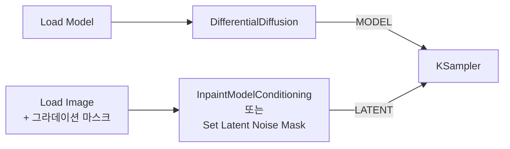

[홈](../../README.md) · [문서 지도](../../README.md)

# Differential Diffusion

> 마스크의 회색조를 보간에 활용해 경계가 부드러운 Inpainting을 만드는 기법을 다룹니다.

[← ControlNet 아키텍처](controlnet-architecture.md)

## 이 장에서 배우는 것

- 일반 Inpaint는 마스크를 검정·흰색으로만 읽지만, 이 기법은 중간 회색까지 읽어 경계를 부드럽게 만듭니다.
- 노드는 MODEL 라인에만 들어갑니다. 마스크는 평소처럼 latent 경로로 전달합니다.

<div class="guide-meta" markdown>
**대상** 인페인팅을 해 봤고 경계 이음새를 없애고 싶은 사용자 · **사전 이해** 마스크를 사용한 Inpainting 워크플로우 · **시간** 5분

**이럴 때 읽으세요** 인페인팅 결과에서 수정한 영역의 경계선이 눈에 띌 때.
</div>

## 1. 개념: "흑백 사이의 보간"

두 방식이 같은 마스크를 어떻게 다르게 읽는지 비교합니다.

| 마스크 값 | 표준 Inpaint | Differential Diffusion |
|---|---|---|
| 검정 (0.0) | 건드리지 않음 | 원본 유지 |
| **회색 (0.5)** | **흰색이나 검정 중 하나로 처리** | **중간 — 원본과 새 생성이 섞임** |
| 흰색 (1.0) | 완전히 변경 | 새로 생성 |
| 결과 | 딱딱한 경계 | 부드러운 전환 |

회색 0.5는 "그 픽셀의 절반이 바뀐다"는 뜻이 아니라, 그 픽셀이 **샘플링 구간의 일부에서만 갱신된다**는 뜻입니다.

## 2. 시각적 비교

| 방식 | 비유 |
|:-----|:-----|
| **일반 Inpaint** | 가위로 자르고 붙이기 (선명한 경계) |
| **Differential Diffusion** | 에어브러시 블렌드 (그라데이션) |

## 3. Pipeline 통합

`DifferentialDiffusion` 노드는 **MODEL 라인에만** 들어갑니다. 입력은 `model`이고, 위젯은 `strength`(범위 0.0~1.0, 기본 `1.0`) 하나입니다. 기본값 `1.0`이 이 문서에서 설명하는 회색조 해석을 완전히 적용한 상태이며, 값을 낮추면 일반 마스크 동작 쪽으로 섞입니다. 처음에는 `1.0` 그대로 두세요.



!!! warning "마스크를 이 노드에 연결하려 하지 마세요"
    `DifferentialDiffusion`에는 마스크 입력이 없습니다. 이 노드는 "마스크를 회색조 그대로 해석하도록 모델의 동작을 바꾸는" 역할만 하고, 마스크 자체는 평소처럼 latent 쪽으로 전달합니다.

**역할 분담:**
- InpaintModelConditioning / Set Latent Noise Mask: "어디를" 인페인트할지 정의
- DifferentialDiffusion: 그 마스크의 회색조를 "얼마나 부드럽게" 해석할지 결정

## 4. 실용 효과

```
마스크 그라데이션:  [검정]──[회색]──[흰색]
denoise 강도:      [ 없음]──[중간]──[전체]
시각적 결과:       [유지 ]──[페이드]──[교체]
                           부드러운 전환
```

## 5. 완료 기준

세 가지를 모두 만족했다면 이 장을 끝냈습니다.

- `DifferentialDiffusion`의 출력 MODEL이 KSampler의 `model`까지 이어지도록 연결했다.
- 마스크를 latent 경로(`InpaintModelConditioning` 또는 `Set Latent Noise Mask`)로 전달했다.
- 회색조 그라데이션이 있는 마스크와 경계가 딱 떨어지는 마스크의 결과 차이를 확인했다.

경계가 뚜렷한 마스크에서는 이 기법의 효과가 거의 나타나지 않습니다. 마스크 자체에 그라데이션을 넣어야 합니다.

## 다음 단계

- [ControlNet 아키텍처](controlnet-architecture.md) — 구조 조건과 함께 쓸 때의 연결
- [제어 기법 실전 워크플로우](example-workflows.md) — 조합 예시

---

[홈](../../README.md) · [문서 지도](../../README.md) · [ControlNet 아키텍처](controlnet-architecture.md)
