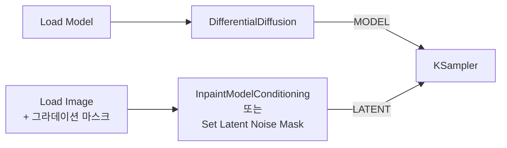

[문서 지도](../../README.md)

# Differential Diffusion

> 마스크의 회색조를 살려 Inpainting 경계를 부드럽게 만듭니다.

## 이 장에서 배우는 것

- 일반 Inpaint는 마스크를 검정·흰색으로만 읽지만, 이 기법은 중간 회색까지 읽어 경계를 부드럽게 만듭니다.
- 노드는 MODEL 라인에만 들어갑니다. 마스크는 평소처럼 latent 경로로 전달합니다.

<div class="guide-meta" markdown>
**대상** 인페인팅을 해 봤고 경계 이음새를 없애고 싶은 사용자 · **사전 이해** 마스크를 사용한 Inpainting 워크플로우 · **시간** 5분

**이럴 때 읽으세요** 인페인팅 결과에서 수정한 영역의 경계선이 눈에 띌 때.
</div>

## 1. 개념: "흑백 사이의 보간"

두 방식이 같은 마스크를 어떻게 다르게 읽는지 비교합니다.

| 마스크 값 | 표준 Inpaint | Differential Diffusion |
|---|---|---|
| 검정 (0.0) | 건드리지 않음 | 원본 유지 |
| **회색 (0.5)** | **흰색이나 검정 중 하나로 처리** | **중간 — 원본과 새 생성이 섞임** |
| 흰색 (1.0) | 완전히 변경 | 새로 생성 |
| 결과 | 딱딱한 경계 | 부드러운 전환 |

회색 0.5는 "그 픽셀의 절반이 바뀐다"는 뜻이 아니라, 그 픽셀이 **샘플링 구간의 일부에서만 갱신된다**는 뜻입니다.

## 2. 마스크 만들기 — Mask Editor

이 기법의 효과를 보려면 마스크 가장자리에 검정(0.0)과 흰색(1.0) 사이의 값이 있어야 합니다. ComfyUI의 Mask Editor에서 만들고, 그 값은 브러시 설정의 `Hardness`로 정합니다.

**순서**

1. `Load Image` 노드를 선택하고 노드 위 선택 툴박스의 마스크 아이콘을 누릅니다. 이미지 미리보기 왼쪽 위의 `Edit or mask image`를 누르거나, 노드를 우클릭해 `Open in Mask Editor`를 골라도 같은 편집기가 열립니다.
2. 왼쪽 도구 패널에서 `Mask Pen`을 고릅니다. 마스크를 칠하는 도구입니다.
3. `Thickness`(1~250)로 브러시 지름을 정하고 `Hardness`를 내립니다. `Hardness`는 0~1이고, `1`이 경계가 뚜렷한 브러시, `0`이 가장 부드러운 브러시입니다. 값을 낮춰 칠하면 마스크 가장자리에 중간값이 생깁니다.
4. 바꿀 영역을 칠합니다. 칠하는 중에 `Alt` + 우클릭 + 드래그로 좌우는 브러시 크기, 위아래는 `Hardness`를 조절합니다.
5. `Save`를 누릅니다. 마스크가 `Load Image` 노드에 적용되고 편집기가 닫힙니다.

상단 바의 `Undo`(`Ctrl + Z`)로 되돌리고 `Redo`(`Ctrl + Shift + Z` 또는 `Ctrl + Y`)로 다시 적용합니다. `Clear`는 마스크 전체를 지우고, `Cancel`은 저장하지 않고 닫습니다.

??? note "나머지 도구와 캔버스 조작 펼치기"
    | 도구 | 대상 레이어 | 동작 |
    |---|---|---|
    | `Paint Pen` | RGB | 원본 이미지에 직접 색을 칠합니다 |
    | `Eraser` | Mask / RGB | 칠한 마스크나 페인트를 지웁니다 |
    | `Paint Bucket` | Mask | 색이 비슷한 영역을 한 번에 채웁니다. `Tolerance`가 채우는 범위를 정합니다 |
    | `Color Select` | Mask | 지정한 색과 일치하는 픽셀을 모두 마스크로 잡습니다 |

    브러시 설정에는 `Shape`(`Arc` / `Rect`), `Opacity`(0~1, 획의 투명도), `Step Size`(1~100, 획을 찍는 간격)도 있습니다.

    상단 바의 `Invert`는 마스크를 반전합니다. 90도 회전과 좌우·상하 반전은 마스크·페인트·원본 세 레이어에 함께 적용됩니다.

    | 조작 | 동작 |
    |---|---|
    | `Space` + 드래그 | 화면 이동 |
    | `Ctrl` + 스크롤 | 확대·축소 |
    | 확대 비율 숫자 클릭 | 100%로 되돌리기 |

## 3. 파이프라인 통합

`DifferentialDiffusion` 노드는 **MODEL 라인에만** 들어갑니다. 입력은 `model`이고, 위젯은 `strength`(범위 0.0~1.0, 기본 `1.0`) 하나입니다. 기본값 `1.0`이 이 문서에서 설명하는 회색조 해석을 완전히 적용한 상태이며, 값을 낮추면 일반 마스크 동작 쪽으로 섞입니다. 처음에는 `1.0` 그대로 두세요.



!!! warning "마스크를 이 노드에 연결하려 하지 마세요"
    `DifferentialDiffusion`에는 마스크 입력이 없습니다. 이 노드는 "마스크를 회색조 그대로 해석하도록 모델의 동작을 바꾸는" 역할만 하고, 마스크 자체는 평소처럼 latent 쪽으로 전달합니다.

**역할 분담:**
- InpaintModelConditioning / Set Latent Noise Mask: "어디를" 인페인트할지 정의
- DifferentialDiffusion: 그 마스크의 회색조를 "얼마나 부드럽게" 해석할지 결정

**한 변수 실험 — Hardness**

Seed와 프롬프트를 고정하고 2절에서 칠한 것과 같은 영역을 두 번 칠해 비교합니다.

| 실행 | Hardness | 관찰할 것 |
|---|---|---|
| A | `1` | 인페인트한 영역의 경계선이 보이는가 |
| B | `0` | 같은 자리의 경계선이 A와 어떻게 다른가 |

## 4. 실용 효과

```
마스크 그라데이션:  [검정]──[회색]──[흰색]
denoise 강도:      [ 없음]──[중간]──[전체]
시각적 결과:       [유지 ]──[페이드]──[교체]
                           부드러운 전환
```

경계가 뚜렷한 마스크에서는 이 기법의 효과가 거의 나타나지 않습니다. 마스크 자체에 그라데이션을 넣어야 합니다.

## 완료 기준

네 가지를 모두 만족했다면 이 장을 끝냈습니다.

- `DifferentialDiffusion`의 출력 MODEL이 KSampler의 `model`까지 이어지도록 연결했다.
- Mask Editor에서 `Hardness`를 낮춘 브러시로 가장자리에 회색조가 있는 마스크를 만들었다.
- 마스크를 latent 경로(`InpaintModelConditioning` 또는 `Set Latent Noise Mask`)로 전달했다.
- 회색조 그라데이션이 있는 마스크와 경계가 뚜렷한 마스크의 결과 차이를 확인했다.

## 다음 단계

- [ControlNet 아키텍처](controlnet-architecture.md) — 구조 조건과 함께 사용할 때의 연결
- [제어 기법 실전 워크플로우](example-workflows.md) — 조합 예시

---

[문서 지도](../../README.md) · [ControlNet 아키텍처](controlnet-architecture.md)
