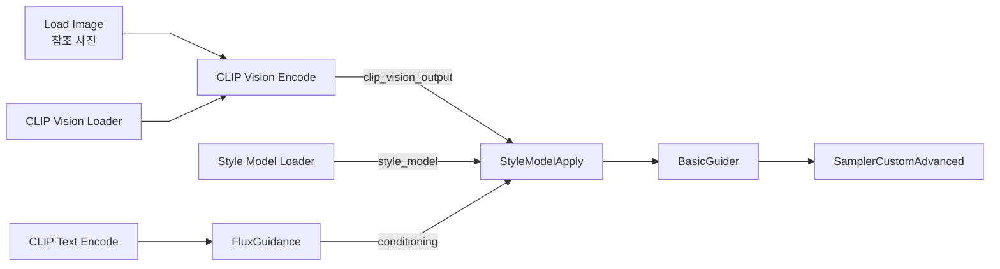
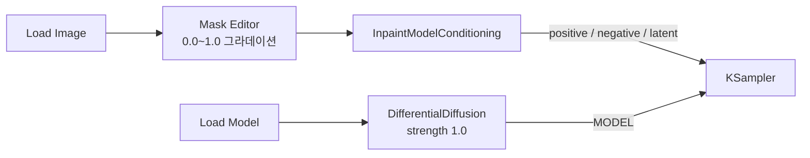

[홈](../../README.md) · [문서 지도](../../README.md)

# 제어 기법 실전 워크플로우

> ControlNet·IPAdapter·Redux·Differential Diffusion을 조합한 실전 예시 모음입니다.

[← ControlNet 아키텍처](controlnet-architecture.md)

## 이 장에서 배우는 것

- 앞의 개별 문서에서 배운 기법들을 하나의 워크플로우에 합칠 때 데이터가 어떤 순서로 흐르는지 보여 줍니다.
- 각 구성은 기본 Text-to-Image 위에 노드를 더하는 방식입니다. 처음부터 새로 만들지 않습니다.

**대상** 제어 기법 문서를 순서대로 읽고 조합을 시도하려는 사용자 · **사전 이해** ControlNet·IPAdapter·Redux 각각의 단독 실행 경험 · **시간** 15분

**이럴 때 읽으세요** 개별 기법은 익혔고 둘 이상을 함께 쓰려 할 때.

## 1. 기본 Text-to-Image + ControlNet

1. FLUX.1 dev FP8 **올인원 체크포인트**를 쓰는 경우 `Load Checkpoint` 하나로 MODEL·CLIP·VAE를 불러옵니다. 파일이 나뉜 구성이라면 `Load Diffusion Model` + `Dual CLIP Loader` + `Load VAE`를 씁니다([모델 가이드](../../02-models/README.md)).
2. `CLIP Text Encode`에 positive 프롬프트를 입력하고 `FluxGuidance`를 연결합니다.
3. 별도 `CLIP Text Encode`에 빈 텍스트를 넣어 negative conditioning을 만듭니다.
4. Load Image → Canny Preprocessor와 Load ControlNet을 준비합니다.
5. guidance가 포함된 positive와 빈 negative를 `Apply ControlNet`에 함께 연결합니다.
6. `Apply ControlNet`의 positive·negative 출력을 KSampler에 연결합니다.
7. MODEL·빈 latent를 KSampler에 연결하고 VAE Decode → Save Image로 마칩니다.

## 2. 스타일 전달: IPAdapter + ControlNet

1. Load Checkpoint
2. Load LoRA (Model and CLIP) — 사전 학습 스타일 (`anime_style.safetensors`)
3. IPAdapter 적용 노드 — 실시간 참조 (참조 이미지: 고흐 그림). 커스텀 노드 설치 필요([IPAdapter](ipadapter.md))
4. CLIP Text Encode
5. Apply ControlNet (Pose) — 구조 제어
6. KSampler

출력: 고흐 애니메이션 스타일의 특정 포즈 초상화

## 3. 포즈 유지 Inpainting

1. Load Image
2. 두 갈래로 나눕니다 — Mask Editor로 얼굴 영역 마스크 / OpenPose 전처리 → Apply ControlNet(포즈 유지)
3. `InpaintModelConditioning`에 positive·negative conditioning과 원본 이미지·마스크·VAE를 연결합니다. 이 노드가 conditioning 두 개와 latent를 함께 출력합니다
4. 세 출력을 KSampler에 연결하고 VAE Decode로 마칩니다

!!! note "VAE Encode (for Inpainting)과 함께 쓰지 않습니다"
    `InpaintModelConditioning`은 이미지와 마스크를 직접 받아 latent까지 만들어 냅니다. 앞에 `VAE Encode (for Inpainting)`을 또 두는 구성은 필요하지 않습니다. 둘 중 하나만 고르세요.

결과: 얼굴 변경, 포즈 유지

## 4. Redux 이미지 변형

Redux는 참조 이미지를 `CONDITIONING`으로 바꿔 텍스트 조건과 함께 전달합니다. 기본 Text-to-Image 구성에 **다음 네 노드를 추가**합니다 — `CLIP Vision Loader`, `CLIP Vision Encode`, `Style Model Loader`, `StyleModelApply`.

- `Conditioning Combine`은 필요하지 않습니다. FluxGuidance의 출력을 `StyleModelApply`에 직접 연결합니다.
- 강도는 `StyleModelApply`의 `strength`(기본 `1.0`)로 조절합니다.
- 전체 절차와 파일 배치는 [FLUX.1 작업 선택과 Redux 실습](../../02-models/flux/flux-practical.md)에 있습니다.

출력: 참조 이미지의 변형

## 5. Differential Diffusion 부드러운 Inpainting

마스크는 **위쪽 경로로만** 갑니다. `DifferentialDiffusion`은 아래쪽 MODEL 라인에서 "마스크의 회색조를 어떻게 읽을지"만 바꿉니다.

마스크는 1번의 latent 경로로만 들어갑니다. `DifferentialDiffusion`에는 마스크 입력이 없습니다([Differential Diffusion](differential-diffusion.md#3-pipeline-통합)).

출력: 그라데이션 전환으로 매끄러운 블렌드

## 완료 기준

세 가지를 모두 만족했다면 이 장을 끝냈습니다.

- 각 기법을 단독으로 한 번씩 실행해 본 뒤 조합했다.
- 조합한 워크플로우에서 MODEL·CONDITIONING·LATENT 세 흐름이 모두 Sampler까지 이어지는지 확인했다.
- 결과가 어긋났을 때 어느 기법의 값을 먼저 볼지 판단할 수 있다.

## 다음 단계

- [ControlNet 연결과 조절](controlnet-pipeline.md) — 조합할 때의 연결 규칙
- [05. 문제 해결](../../05-troubleshooting/README.md) — 적용 후 결과가 어긋날 때

---

[홈](../../README.md) · [문서 지도](../../README.md) · [ControlNet 아키텍처](controlnet-architecture.md)
