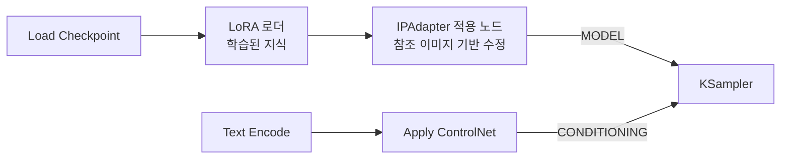

[문서 지도](../../README.md)

# IPAdapter

> 참조 이미지 한 장으로 스타일과 구성을 옮깁니다. 아키텍처마다 전용 모델과 이미지 인코더가 다릅니다.

## 이 장에서 배우는 것

- IPAdapter는 참조 이미지를 그 자리에서 분석해 MODEL을 수정합니다. 미리 학습해 두는 LoRA와 대비됩니다.
- 아키텍처마다 전용 모델이 필요하고, 함께 사용할 CLIP Vision 인코더도 제공자마다 다릅니다.

<div class="guide-meta" markdown>
**대상** LoRA는 사용해 봤고 참조 이미지로 분위기를 옮기려는 사용자 · **사전 이해** `MODEL` 라인의 개념, 커스텀 노드 설치 경험 · **시간** 10분

**이럴 때 읽으세요** 마음에 드는 이미지 한 장의 분위기를 새 생성물에 옮기고 싶을 때.
</div>

## 1. 무엇을 받아 무엇을 바꾸는가

IPAdapter는 참조 이미지 한 장을 CLIP Vision으로 인코딩해 그 결과로 `MODEL`을 수정합니다. LoRA처럼 미리 학습해 두는 것이 아니라 실행할 때마다 그 이미지를 다시 읽습니다.

| 기법 | 받는 입력 | 바꾸는 것 |
|:-----|:-----|:-----|
| **ControlNet** | 전처리한 구조 이미지 | `CONDITIONING` |
| **IPAdapter** | 참조 이미지 | `MODEL` |

## 2. IPAdapter vs LoRA

| 특징 | LoRA | IPAdapter |
|:-----|:-----|:----------|
| **수정 대상** | MODEL | MODEL |
| **라인** | 동일 (Model 라인) | 동일 (Model 라인) |
| **방식** | 사전 학습된 가중치 병합 | 실시간 이미지 분석 |
| **입력** | 없음 (이미 학습됨) | 참조 이미지 |
| **용도** | 일관된 스타일/캐릭터 | 임의 이미지의 스타일 |

LoRA는 배포된 파일 안에 가중치가 이미 들어 있어 참조 이미지를 넣지 않습니다. IPAdapter는 `Load Image`로 넣은 이미지가 매 실행마다 인코딩됩니다. 같은 스타일을 반복해 사용할 것이면 LoRA, 이미지마다 다른 참조를 사용할 것이면 IPAdapter입니다.

## 3. 파이프라인 위치



MODEL 라인과 CONDITIONING 라인은 **서로 다른 경로**로 흐르다 KSampler에서 만납니다. IPAdapter는 왼쪽 라인에서만 동작합니다.

## 4. 모델 호환성

아키텍처마다 전용 IPAdapter가 필요합니다. 서로 바꿔 사용할 수 없습니다.

| Base Model | IPAdapter Model | CLIP Vision | 배포처 |
|:-----------|:----------------|:------------|:-------|
| **SD 1.5** | `ip-adapter-plus_sd15.safetensors` | OpenCLIP ViT-H-14 | [h94/IP-Adapter](https://huggingface.co/h94/IP-Adapter) |
| **SDXL** | `ip-adapter-plus_sdxl_vit-h.safetensors` | OpenCLIP ViT-H-14 또는 ViT-BigG-14 | [h94/IP-Adapter](https://huggingface.co/h94/IP-Adapter) |
| **Flux (XLabs)** | `flux-ip-adapter-v2.safetensors` | CLIP-ViT-L-14 (`openai/clip-vit-large-patch14`) | [XLabs-AI/flux-ip-adapter-v2](https://huggingface.co/XLabs-AI/flux-ip-adapter-v2) |
| **Flux (InstantX)** | `ip-adapter.bin` | SigLIP-so400m-patch14-384 | [InstantX/FLUX.1-dev-IP-Adapter](https://huggingface.co/InstantX/FLUX.1-dev-IP-Adapter) |

!!! warning "Flux는 제공자마다 이미지 인코더가 다릅니다"
    Flux용 IPAdapter를 하나로 묶어 "SigLIP를 사용한다"고 외우면 안 됩니다. XLabs는 CLIP-ViT-L, InstantX는 SigLIP를 사용합니다. 인코더가 어긋나면 결과가 무너지거나 로드에 실패하므로, 내려받은 IPAdapter의 배포 페이지가 지정한 인코더를 그대로 받으세요.

**호환 불가 이유:**
```
SDXL = UNet 아키텍처
Flux = DiT (Diffusion Transformer) 아키텍처

→ 완전히 다른 내부 구조
→ IPAdapter도 각 아키텍처에 맞게 학습 필요
```

## 5. Flux IPAdapter 옵션

| 제공자 | 모델 파일 | 이미지 인코더 | Sampler | 저장소 |
|:-------|:-----|:--------|:-----|:-------|
| **XLabs v1/v2** | `flux-ip-adapter-v2.safetensors` | CLIP-ViT-L-14 | XLabs 전용 Sampler | [XLabs-AI](https://huggingface.co/XLabs-AI/flux-ip-adapter-v2) |
| **InstantX** | `ip-adapter.bin` | SigLIP-so400m-patch14-384 | 표준 KSampler | [InstantX](https://huggingface.co/InstantX/FLUX.1-dev-IP-Adapter) |
| **Shakker Labs** | InstantX 기반 | SigLIP-so400m-patch14-384 | 표준 KSampler | [Shakker-Labs](https://huggingface.co/Shakker-Labs) |

위 저장소에서 현재 파일명과 요구 인코더를 확인한 뒤 받으세요. 이름이 비슷한 파일이 여러 버전으로 유통됩니다.

**준비물이 많습니다.** 위 표처럼 제공자마다 짝이 되는 이미지 인코더가 다르고, XLabs는 전용 sampler까지 요구합니다. 셋 중 하나만 어긋나도 로드에 실패하거나 참조가 반영되지 않습니다. Flux에서 참조 이미지를 사용할 일이라면 커스텀 노드가 필요 없는 코어 기능 [Flux Redux](flux-redux.md)를 먼저 확인하세요.

이 절의 모델·상태 정보는 갱신이 빠릅니다. 실제 사용 전 각 제공자의 저장소에서 현재 상태를 확인하세요.

## 6. 문제 해결

| 증상 | 확인 순서 |
|---|---|
| `IPAdapter model not found` | 1. 사용하는 Base 모델 확인<br>2. [모델 호환성](#4-모델-호환성) 표에서 그 계열의 파일 내려받기<br>3. `ComfyUI/models/ipadapter/`에 배치<br>4. 파일명 대소문자 확인<br>5. ComfyUI 재시작 |
| `SDXL IPAdapter incompatible with Flux` | 아키텍처가 다릅니다. XLabs 또는 InstantX의 Flux 전용 모델을 받습니다 |
| 참조 이미지의 스타일이 약하게 반영됨 | 1. `weight`를 0.8에서 1.2까지 올려 비교<br>2. 해상도가 높은 참조 이미지로 교체<br>3. CLIP Vision이 로드됐는지 확인<br>4. 통합 로더를 사용한다면 preset 확인 |

**weight 구간**

```text
은은함:  weight 0.5-0.7
표준:   weight 0.8-1.0
강함:   weight 1.2-1.5
```

## 완료 기준

세 가지를 모두 만족했다면 이 장을 끝냈습니다.

- IPAdapter가 MODEL 라인을, ControlNet이 CONDITIONING 라인을 수정한다는 차이를 설명할 수 있다.
- 사용하는 베이스 모델에 맞는 IPAdapter 모델과 CLIP Vision 인코더 조합을 고를 수 있다.
- LoRA와 IPAdapter를 각각 언제 사용할지 판단할 수 있다.

## 다음 단계

- [Flux Redux](flux-redux.md) — Flux에서 참조 이미지를 사용하는 코어 경로
- [ControlNet 아키텍처](controlnet-architecture.md) — 구조 제어와의 차이
- [LoRA](../lora/README.md) — 사전 학습 방식과의 비교

---

[문서 지도](../../README.md) · [ControlNet 아키텍처](controlnet-architecture.md)
