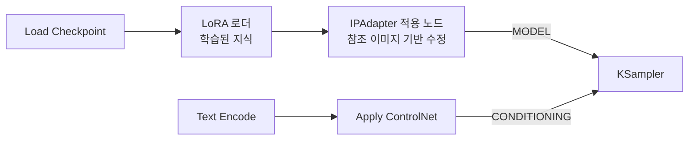

[홈](../../README.md) · [문서 지도](../../README.md)

# IPAdapter

> 한 장의 참조 이미지로 스타일·구성을 옮기는 IPAdapter의 개념과 파이프라인 위치, 모델 호환성을 다룹니다.

[← ControlNet 아키텍처](controlnet-architecture.md)

## 이 장에서 배우는 것

- IPAdapter는 참조 이미지를 그 자리에서 분석해 MODEL을 수정합니다. 미리 학습해 두는 LoRA와 대비됩니다.
- 아키텍처마다 전용 모델이 필요하고, 함께 쓸 CLIP Vision 인코더도 제공자마다 다릅니다.

<div class="guide-meta" markdown>
**대상** LoRA는 써 봤고 참조 이미지로 분위기를 옮기려는 사용자 · **사전 이해** `MODEL` 라인의 개념, 커스텀 노드 설치 경험 · **시간** 10분

**이럴 때 읽으세요** 마음에 드는 이미지 한 장의 분위기를 새 생성물에 옮기고 싶을 때.
</div>

## 1. 개념: "1-Image LoRA"

참조 이미지의 스타일/주제를 실시간으로 새로운 생성물에 전달.

**비유:**

| 방식 | 비유 |
|:-----|:-----|
| **ControlNet** | "이렇게 그려" (구조/포즈 지시) |
| **IPAdapter** | "이 느낌으로 그려" (스타일/분위기 참조) |

## 2. IPAdapter vs LoRA

| 특징 | LoRA | IPAdapter |
|:-----|:-----|:----------|
| **수정 대상** | MODEL | MODEL |
| **라인** | 동일 (Model 라인) | 동일 (Model 라인) |
| **방식** | 사전 학습된 가중치 병합 | 실시간 이미지 분석 |
| **입력** | 없음 (이미 학습됨) | 참조 이미지 |
| **용도** | 일관된 스타일/캐릭터 | 임의 이미지의 스타일 |

**예시:**
```
LoRA: 화가가 고흐 스타일을 배움 (사전 학습)
IPAdapter: 화가가 지금 이 고흐 그림을 따라 그림 (실시간 참조)
```

## 3. Pipeline 위치



MODEL 라인과 CONDITIONING 라인은 **서로 다른 경로**로 흐르다 KSampler에서 만납니다. IPAdapter는 왼쪽 라인에서만 동작합니다.

## 4. 모델 호환성

아키텍처마다 전용 IPAdapter가 필요합니다. 서로 바꿔 쓸 수 없습니다.

| Base Model | IPAdapter Model | CLIP Vision |
|:-----------|:----------------|:------------|
| **SD 1.5** | `ip-adapter-plus_sd15.safetensors` | OpenCLIP ViT-H-14 |
| **SDXL** | `ip-adapter-plus_sdxl_vit-h.safetensors` | OpenCLIP ViT-H-14 또는 ViT-BigG-14 |
| **Flux (XLabs)** | `flux-ip-adapter-v2.safetensors` | CLIP-ViT-L-14 (`openai/clip-vit-large-patch14`) |
| **Flux (InstantX)** | `ip-adapter.bin` | SigLIP-so400m-patch14-384 |

!!! warning "Flux는 제공자마다 이미지 인코더가 다릅니다"
    Flux용 IPAdapter를 하나로 묶어 "SigLIP를 쓴다"고 외우면 안 됩니다. XLabs는 CLIP-ViT-L, InstantX는 SigLIP를 씁니다. 인코더가 어긋나면 결과가 무너지거나 로드에 실패하므로, 내려받은 IPAdapter의 배포 페이지가 지정한 인코더를 그대로 받으세요.

**호환 불가 이유:**
```
SDXL = UNet 아키텍처
Flux = DiT (Diffusion Transformer) 아키텍처

→ 완전히 다른 내부 구조
→ IPAdapter도 각 아키텍처에 맞게 학습 필요
```

## 5. Flux IPAdapter 옵션

| 제공자 | 모델 파일 | 이미지 인코더 | Sampler |
|:-------|:-----|:--------|:-----|
| **XLabs v1/v2** | `flux-ip-adapter-v2.safetensors` | CLIP-ViT-L-14 | XLabs 전용 Sampler |
| **InstantX** | `ip-adapter.bin` | SigLIP-so400m-patch14-384 | 표준 KSampler |
| **Shakker Labs** | InstantX 기반 | SigLIP-so400m-patch14-384 | 표준 KSampler |

각 제공자의 저장소에서 현재 파일명과 요구 인코더를 확인한 뒤 받으세요. 이름이 비슷한 파일이 여러 버전으로 유통됩니다.

**현재 한계:** Flux IPAdapter 스타일 전달은 SD/SDXL만큼 안정적이지 않습니다. Flux에서 참조 이미지를 쓸 때는 코어 기능인 [Flux Redux](flux-redux.md)를 먼저 확인하세요.

이 절의 모델·상태 정보는 갱신이 빠릅니다. 실제 사용 전 각 제공자의 저장소에서 현재 상태를 확인하세요.

## 완료 기준

세 가지를 모두 만족했다면 이 장을 끝냈습니다.

- IPAdapter가 MODEL 라인을, ControlNet이 CONDITIONING 라인을 수정한다는 차이를 설명할 수 있다.
- 쓰는 베이스 모델에 맞는 IPAdapter 모델과 CLIP Vision 인코더 조합을 고를 수 있다.
- LoRA와 IPAdapter를 각각 언제 쓸지 판단할 수 있다.

## 다음 단계

- [Flux Redux](flux-redux.md) — Flux에서 참조 이미지를 쓰는 코어 경로
- [ControlNet 아키텍처](controlnet-architecture.md) — 구조 제어와의 차이
- [LoRA](../lora/README.md) — 사전 학습 방식과의 비교

---

[홈](../../README.md) · [문서 지도](../../README.md) · [ControlNet 아키텍처](controlnet-architecture.md)
