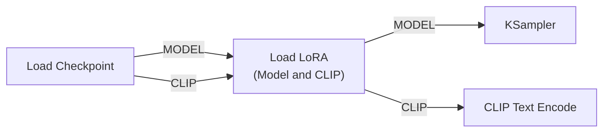

[문서 지도](../../README.md)

# LoRA 기본 — 스타일 얹기

> 기존 모델에 특정 스타일을 추가하는 방법

## 이 장에서 배우는 것

- LoRA가 무엇이고 전체 미세조정과 무엇이 다른지
- `Load LoRA (Model and CLIP)` 노드를 MODEL·CLIP 라인에 끼우는 법
- 트리거 워드를 확인하고 프롬프트에 넣는 법
- strength를 바꿔 효과 강도를 정하는 법

<div class="guide-meta" markdown>
**대상** 모델 전체를 새로 학습하지 않고 특정 화풍만 추가하고 싶은 분 · **사전 이해** 기본 이미지 생성 경험 · **시간** 20분

**이럴 때 읽으세요** 특정 스타일이나 캐릭터를 빠르게 적용하고 싶을 때.
</div>

## LoRA란 무엇인가?

### 정의

LoRA는 체크포인트에 얹어 사용하는 별도 파일입니다. 전체 모델을 다시 학습하지 않고 일부 계산만 보정합니다.

### 작동 원리

LoRA는 모델을 바꾸지 않습니다. 생성할 때 **모델의 일부 계산에 작은 보정값을 얹습니다.** 그래서 원래 모델의 능력은 그대로 두고 화풍만 더할 수 있습니다.

체크포인트 파일 자체는 바뀌지 않습니다. `Load LoRA` 노드를 빼면 원래 결과로 돌아옵니다.

### 왜 LoRA를 사용하는가

원하는 화풍을 얻는 방법은 두 가지입니다. **모델 전체를 다시 학습하거나(전체 미세조정), 얹는 파일 하나만 만드는 것(LoRA)**입니다. 아래는 **만드는 사람 입장**에서의 차이입니다. 받아서 사용하는 입장에서 중요한 것은 마지막 두 줄입니다.

| 항목 | 전체 미세조정 — 모델을 다시 만듦 | LoRA — 얹는 파일만 만듦 |
|------|-------------|------|
| 만들 때 필요한 학습 이미지 | 수천 장 | 수십 장 |
| 만드는 데 걸리는 시간 | 수일~수주 | 수시간 |
| **내려받는 파일 크기** | **2~7GB** (체크포인트 전체) | **10~200MB** |
| **사용 방법** | 체크포인트 자체를 교체 | 사용하던 체크포인트에 **얹어서** 적용 |

받아서 사용하는 입장에서 달라지는 것은 셋입니다. **파일이 작고, 사용하던 체크포인트를 그대로 두며, 노드 하나만 빼면 원래 결과로 돌아옵니다.**

---

## ComfyUI에서 사용하기

### 기본 워크플로우

**Load LoRA (Model and CLIP)** 연결:

- model: Load Checkpoint의 MODEL
- clip: Load Checkpoint의 CLIP
- lora_name: watercolor_style.safetensors
- strength_model: 0.8, strength_clip: 0.8 (처음에는 두 값을 같게)

출력된 MODEL은 KSampler로, CLIP은 CLIP Text Encode로 각각 연결합니다. 연결 그림은 아래 3번에 있습니다.

### 단계별 가이드

**1. LoRA 파일 준비**

[Civitai](https://civitai.com)나 [Hugging Face](https://huggingface.co)에서 받아 `ComfyUI/models/loras/`에 넣습니다. 파일 하나에 10~200MB 정도이고 이름은 `watercolor_style.safetensors`처럼 붙습니다.

**2. LoRA 로더 노드 추가**
Add Node → model → loaders → **Load LoRA (Model and CLIP)**

!!! warning "이름이 비슷한 노드가 두 개입니다"
    검색 목록에는 **`Load LoRA`**와 **`Load LoRA (Model and CLIP)`**가 함께 나옵니다.

    | 표시 이름 | 입력 | 언제 사용하나 |
    |---|---|---|
    | `Load LoRA (Model and CLIP)` | model + clip | **일반적인 경우. 이 문서의 기준** |
    | `Load LoRA` | model만 | CLIP이 없는 구성에서 MODEL만 수정할 때 |

    짧은 이름인 `Load LoRA`에는 `clip` 입력이 없어 아래 3번 연결을 할 수 없습니다. 트리거 워드가 있는 LoRA는 CLIP 쪽도 함께 거쳐야 하므로 `(Model and CLIP)` 쪽을 고릅니다.

**3. 연결**

로더를 Load Checkpoint와 그다음 노드들 **사이에 끼워 넣습니다.** MODEL과 CLIP 두 줄을 모두 통과시켜야 합니다.



Load Checkpoint에서 KSampler로 **직접 가던 선을 끊고** 그 사이에 로더를 넣는 것입니다. CLIP 쪽을 빠뜨리면 트리거 워드가 작동하지 않습니다.

**4. 설정**
```
lora_name: 원하는 LoRA 파일 선택
strength_model: 0.8
strength_clip: 0.8
```

**5. 실행**
`Run` 버튼을 누르고, 프롬프트에 트리거 워드가 들어갔는지 확인합니다.

---

## 트리거 워드

LoRA 효과가 보이지 않을 때는 강도보다 **트리거 워드(trigger word)** 누락을 먼저 확인합니다.

일부 LoRA는 특정 단어와 함께 학습됩니다. 그 단어를 프롬프트에 적어야 학습된 화풍이나 캐릭터가 불려 나옵니다. 노드를 연결하고 strength를 올려도 이 단어가 없으면 효과가 약하거나 전혀 나타나지 않습니다.

- 트리거 워드는 **내려받은 페이지의 설명란**에 적혀 있습니다. Civitai에서는 `Trigger Words` 항목입니다.
- 적는 위치는 Positive 프롬프트입니다. 예: `watercolor_style_v2, a cat sitting on a windowsill`
- 트리거 워드가 없다고 적힌 LoRA도 있습니다. 그런 경우에는 프롬프트에 추가하지 않아도 됩니다.
- 예시 이미지가 있다면 그 프롬프트를 그대로 넣어 재현해 봅니다. 트리거 워드가 빠졌는지 여기서 드러납니다.

## 강도 조절

### strength_model과 strength_clip의 차이

`Load LoRA (Model and CLIP)`에는 강도 위젯이 두 개입니다.

| 위젯 | 무엇에 적용되나 | 결과에 나타나는 것 |
|---|---|---|
| `strength_model` | 이미지를 만드는 모델 쪽 | 화풍·형태·질감 자체의 변화 |
| `strength_clip` | 텍스트를 해석하는 CLIP 쪽 | 트리거 워드와 프롬프트 단어의 해석 변화 |

처음에는 **두 값을 같게** 두고 함께 움직입니다. 배포 페이지의 권장값도 두 값을 같게 적은 경우가 많습니다. 화풍은 유지하되 프롬프트 반영만 조절하고 싶을 때처럼 목적이 분명해진 다음에 값을 분리합니다.

### Strength 가이드

| Strength | 효과 | 사용 상황 |
|----------|------|----------|
| 0.3-0.5 | 은은한 힌트 | 스타일을 살짝만 얹을 때 |
| 0.6-0.8 | 중간 효과 | **여기서 시작해 위아래로 비교** |
| 0.9-1.0 | 강한 효과 | 스타일을 뚜렷하게 낼 때 |
| 1.0 초과 | 형태까지 바뀜 | 과해지는 지점을 확인할 때. 상시 사용값은 아닙니다 |

### 값의 양 끝 확인

0.3 이하에서는 스타일이 거의 보이지 않고, 1.0을 넘기면 디테일이 뭉개집니다. 두 끝을 한 번씩 만들어 보면 위 표의 구간이 어디에 해당하는지 눈으로 확인할 수 있습니다.

### 한 변수 실험

Seed와 프롬프트를 고정하고 수채화 LoRA의 strength만 바꿔 세 장을 만듭니다.

| 실행 | strength | 관찰할 것 |
|---|---:|---|
| A | 0.5 | 수채화 느낌이 나타나기 시작하는가 |
| B | 0.8 | 스타일과 원래 형태가 균형을 이루는가 |
| C | 1.2 | 스타일이 과해져 형태나 디테일이 무너지는가 |

세 장을 나란히 놓고 목적에 맞는 값을 고릅니다. 값이 높다고 좋은 결과가 아닙니다.

---

## 완료 기준

네 가지를 모두 만족했다면 이 장을 끝냈습니다.

- `Load LoRA (Model and CLIP)`을 MODEL·CLIP 라인에 끼워 이미지를 만들었다.
- 사용하는 LoRA에 트리거 워드가 있는지 확인하고 프롬프트에 반영했다.
- Seed를 고정하고 strength만 바꿔 세 장을 비교했다.
- `strength_model`과 `strength_clip`이 각각 무엇에 적용되는지 설명할 수 있다.

## 다음 단계

- [LoRA 조합과 선택](combining.md) — 여러 개를 겹치고 고르는 기준
- [ControlNet 아키텍처](../controlnet/controlnet-architecture.md) — 구조·구도 제어
- [워크플로우 예제](../../04-workflows/README.md) — LoRA 활용 예제

---

[문서 지도](../../README.md) · [LoRA 조합과 선택](combining.md)
