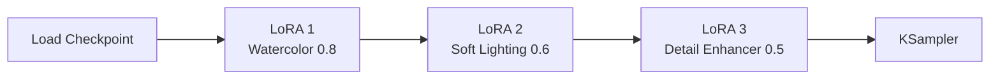

[홈](../../README.md) · [문서 지도](../../README.md)

# LoRA 조합과 선택

> 여러 LoRA를 함께 쓸 때의 연결과 충돌, 그리고 어떤 LoRA를 고를지 판단하는 기준입니다.

[← LoRA 기본](README.md)

## 이 장에서 배우는 것

- 여러 LoRA를 체인으로 잇는 방법과 끊겼을 때 생기는 일
- 서로 충돌하는 조합과 잘 어울리는 조합의 차이
- 목적별 LoRA 종류와 고를 때 확인할 것
- 효과가 안 보이거나 과할 때의 조치 순서

<div class="guide-meta" markdown>
**대상** LoRA 하나는 써 봤고 여러 개를 겹치려는 사용자 · **사전 이해** [LoRA 기본](README.md)의 연결과 강도 조절 · **시간** 15분

**이럴 때 읽으세요** LoRA를 두세 개 겹쳤더니 결과가 이상해졌을 때.
</div>

## 여러 LoRA 동시 사용

### 체인 연결



각 로더는 모두 `Load LoRA (Model and CLIP)`이며, **앞 로더의 MODEL·CLIP 출력을 다음 로더의 입력으로** 잇습니다. 한 줄로 늘어선 모양이라 중간에서 끊기면 그 뒤의 LoRA만 적용됩니다.

### 주의사항

**권장:**
- 2-3개까지 적당
- 하나씩 추가하며 그때마다 결과를 확인

**문제 발생 가능:**
- 4개 이상: 충돌 가능
- 높은 Strength: 품질 저하
- 비슷한 LoRA: 효과 중복

### 조합 전략

**잘 어울리는 조합** — 역할이 겹치지 않고 강도에 차이를 둡니다.

```
스타일 LoRA (0.8) + 조명 LoRA (0.5) + 디테일 LoRA (0.4)
```

**충돌하는 조합** — 같은 역할(화풍)을 하는 LoRA를 같은 강도로 겹칩니다.

```
수채화 LoRA (1.0) + 유화 LoRA (1.0) + 애니메이션 LoRA (1.0)
```

화풍 LoRA는 한 번에 하나만 강하게 쓰고, 나머지는 조명·디테일처럼 다른 역할을 맡기세요.

---

## LoRA 선택 가이드

??? note "LoRA 종류 네 가지 펼치기"
    **1. 스타일 LoRA**
    ```
    - 수채화, 유화, 애니메이션 등
    - 전체 이미지 스타일 변경
    - 예: watercolor_style.safetensors
    ```

    **2. 캐릭터 LoRA**
    ```
    - 특정 캐릭터 일관성
    - 얼굴, 의상 특징 유지
    - 예: character_lora.safetensors
    ```

    **3. 컨셉 LoRA**
    ```
    - 특정 분위기나 테마
    - 사이버펑크, 판타지 등
    - 예: cyberpunk_aesthetic.safetensors
    ```

    **4. 디테일 LoRA**
    ```
    - 세부 묘사 강화
    - 품질 향상
    - 예: add_detail.safetensors
    ```

### 좋은 LoRA 특징

- 명확한 목적 (화풍, 캐릭터, 개념)
- 충분한 학습 데이터
- 활발한 커뮤니티 피드백
- 다양한 예시 이미지

### 다운로드 사이트

??? note "다운로드 사이트 링크 펼치기"
    **주요 플랫폼:**
    - [Civitai](https://civitai.com) - 가장 큰 커뮤니티
    - [Hugging Face](https://huggingface.co) - 공식 모델들

    **체크 사항:**
    - 라이선스 확인
    - 호환 모델 (SD 1.5 / SDXL / Flux)
    - 사용자 리뷰
    - 예시 이미지 품질

---

## 실전 팁

### 효과적인 사용법

**1. 단계적 테스트**
Strength 0.5 → 0.7 → 0.9처럼 점진적으로 올리며 최적값을 찾습니다.

**2. 프롬프트 조합**
수채화 LoRA에 `watercolor painting style` 프롬프트를 함께 쓰면 두 조건이 서로를 보강합니다.

**3. 네거티브 프롬프트**
```
LoRA 스타일이 너무 강하면
Negative에 스타일 키워드 추가
```

### 문제 해결

**LoRA 효과가 안 보여요**

아래 순서로 확인합니다. 대부분 1번과 2번에서 해결됩니다.

1. **트리거 워드**를 Positive 프롬프트에 적었는지 (가장 흔한 원인)
2. LoRA가 지금 쓰는 **체크포인트와 같은 계열**인지 (SD 1.5용 LoRA는 SDXL·Flux에서 동작하지 않습니다)
3. `Load LoRA (Model and CLIP)`을 썼고 MODEL과 CLIP이 **둘 다** 연결됐는지
4. 그래도 약하면 Strength를 0.8~1.0으로 올리기

**이미지 품질이 떨어진다**
- Strength 낮추기 (0.5-0.7)
- LoRA 개수 줄이기
- 다른 LoRA 시도

**스타일이 너무 강하다**
- Strength 0.3-0.5로 낮추기
- Negative Prompt에 스타일 키워드

---

## 완료 기준

네 가지를 모두 만족했다면 이 장을 끝냈습니다.

- 로더 두 개 이상을 체인으로 잇고 결과를 확인했다.
- 역할이 겹치는 LoRA를 같은 강도로 겹치면 충돌한다는 점을 안다.
- 효과가 안 보일 때 트리거 워드부터 확인하는 순서를 익혔다.
- 내려받기 전 라이선스와 호환 모델을 확인했다.

## 다음 단계

- [ControlNet 아키텍처](../controlnet/controlnet-architecture.md) — 구조·구도 제어
- [워크플로우 예제](../../04-workflows/README.md) — LoRA 활용 예제
- [Flux 모델 가이드](../../02-models/flux/README.md) — Flux용 LoRA

---

[홈](../../README.md) · [LoRA 기본](README.md)
