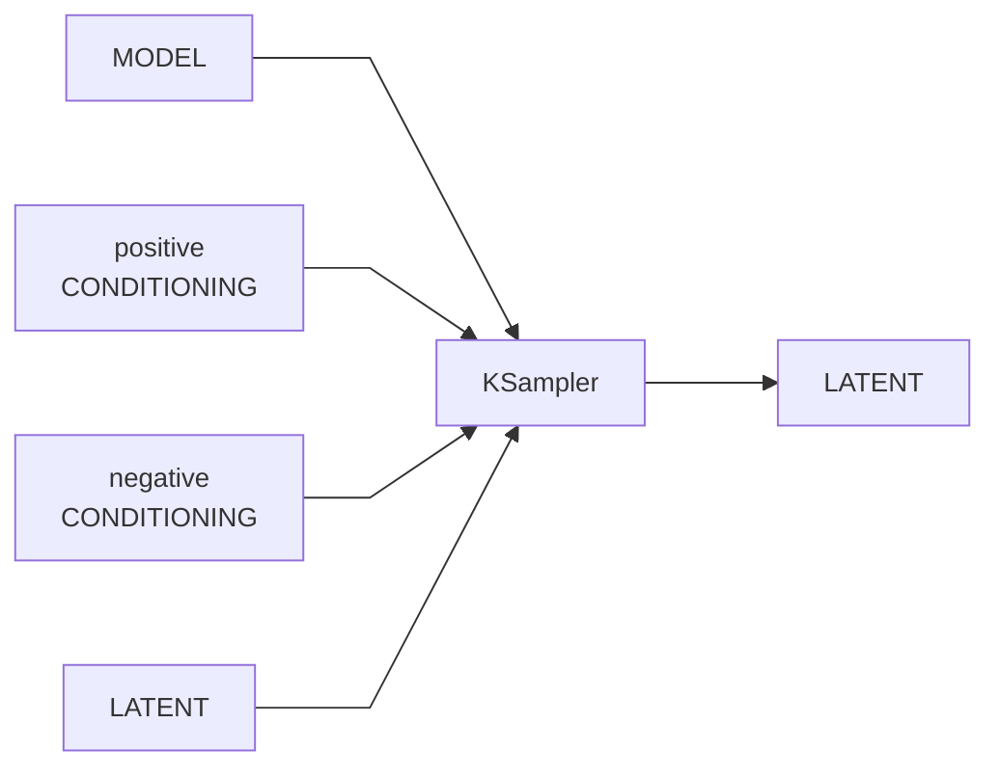
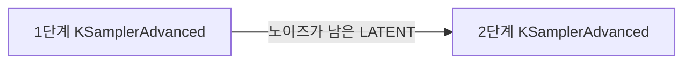
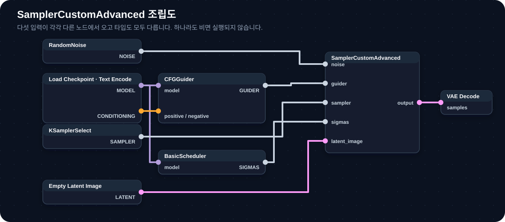
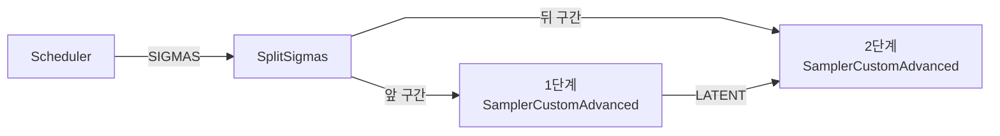

[홈](../../README.md) · [문서 지도](../../README.md)

# KSampler·KSamplerAdvanced·SamplerCustomAdvanced

> 이름이 비슷한 세 노드의 역할과 실제 입력을 구분합니다.

## 이 장에서 배우는 것

- `KSampler`는 일반적인 생성과 이미지 변형에 필요한 설정을 한 노드에 모아 둡니다.
- `KSamplerAdvanced`는 같은 샘플링 과정을 사용하면서 노이즈 추가 여부와 시작·종료 스텝을 직접 지정합니다.
- `SamplerCustomAdvanced`는 노이즈·guider·sampler·sigma schedule을 각각 별도 노드에서 받아 조립합니다.

**대상** KSampler를 사용해 봤고 샘플링 과정을 더 세밀하게 나누려는 사용자 · **사전 이해** Seed, Steps, CFG, Sampler, Scheduler, Denoise · **시간** 15분

**이럴 때 읽으세요** 두 단계 샘플링, Refiner, sigma 분할 또는 커스텀 guider가 필요할 때.

## 1. KSampler

일반적인 Text-to-Image와 Image-to-Image 작업의 기본 노드입니다.

### 주요 입력

| 입력 | 역할 |
|---|---|
| `model` | 디노이징 모델 |
| `seed` | 시작 노이즈를 만드는 기준값 |
| `steps` | 추론에서 사용할 샘플링 스텝 수 |
| `cfg` | classifier-free guidance 강도 |
| `sampler_name` | 한 단계에서 latent를 갱신하는 알고리즘 |
| `scheduler` | 스텝별 sigma를 배치하는 방식 |
| `positive` / `negative` | 조건과 반대 조건 |
| `latent_image` | 시작 latent와 크기 |
| `denoise` | 전체 sigma 구간 중 사용할 비율 |

`denoise=1.0`은 전체 샘플링 구간을 사용합니다. 1.0보다 낮추면 뒤쪽 일부 구간만 사용하므로 기존 latent의 구조를 더 많이 유지할 수 있습니다.

## 2. KSamplerAdvanced

`KSamplerAdvanced`는 기본 KSampler와 같은 핵심 입력을 사용하면서 다음 제어를 직접 노출합니다.

| 추가 입력 | 역할 |
|---|---|
| `add_noise` | 이 단계에서 새 노이즈를 추가할지 선택 |
| `noise_seed` | 추가할 노이즈의 Seed |
| `start_at_step` | 전체 스케줄에서 시작할 스텝 |
| `end_at_step` | 전체 스케줄에서 멈출 스텝 |
| `return_with_leftover_noise` | 다음 샘플링 단계가 이어받을 노이즈를 남길지 선택 |

기본 KSampler의 `denoise` 대신 시작·종료 스텝을 직접 지정한다는 점이 핵심입니다.

### 두 단계 샘플링 개념

각 단계의 설정은 다음과 같이 짝을 맞춥니다.

| 설정 | 1단계 | 2단계 |
|---|---|---|
| `add_noise` | `enable` | `disable` |
| `start_at_step` | `0` | 1단계의 `end_at_step`과 같은 값 |
| `end_at_step` | 분할 지점 | 전체 steps |
| `return_with_leftover_noise` | `enable` | `disable` |

두 단계는 같은 전체 `steps`와 호환되는 스케줄을 사용해야 합니다. 분할 지점 전후에서 모델이나 conditioning을 바꿀 수 있지만, 결과가 자동으로 더 좋아지는 것은 아닙니다.

!!! warning "노이즈를 두 번 넣지 않기"
    두 번째 단계에서 `add_noise=enable`로 두면 첫 단계의 중간 결과에 새 노이즈가 추가되어 자연스럽게 이어지지 않을 수 있습니다.

## 3. SamplerCustomAdvanced

`SamplerCustomAdvanced`에는 Seed, CFG, sampler 이름, scheduler 이름을 직접 입력하는 위젯이 없습니다. 다음 다섯 입력을 각각 별도 노드에서 받습니다.

| 입력 | 데이터 타입 | 일반적인 공급 노드 |
|---|---|---|
| `noise` | `NOISE` | `RandomNoise` 또는 `DisableNoise` |
| `guider` | `GUIDER` | `CFGGuider`, `BasicGuider` 등 |
| `sampler` | `SAMPLER` | `KSamplerSelect` |
| `sigmas` | `SIGMAS` | `BasicScheduler`, `KarrasScheduler`, 모델 전용 Scheduler |
| `latent_image` | `LATENT` | Empty Latent 또는 VAE Encode 결과 |

출력은 `output`과 `denoised_output` 두 가지입니다. 일반적인 후속 VAE Decode에는 먼저 `output`을 사용합니다.

### 기본 조립 예

다섯 입력이 각각 다른 노드에서 옵니다. 이미지를 선택하면 원본 크기로 볼 수 있습니다.

다섯 입력이 각각 다른 노드에서 오고, 타입도 모두 다릅니다. 하나라도 비면 실행되지 않습니다.

이 방식의 장점은 품질이 자동으로 높아지는 것이 아니라 구성 요소를 분리해 교체·분할·검사할 수 있다는 점입니다.

## 4. Sigma와 Scheduler 노드

Sigma는 샘플링 시점의 노이즈 수준을 나타냅니다. `SamplerCustomAdvanced`는 sigma 목록을 **입력받아 사용**할 뿐, `sigma_min`, `sigma_max`, `rho`를 직접 설정하지 않습니다.

### BasicScheduler

| 입력 | 역할 |
|---|---|
| `model` | 모델에 맞는 sigma 범위를 확인 |
| `scheduler` | `normal`, `karras`, `simple` 등 선택 |
| `steps` | sigma 구간 수 |
| `denoise` | 사용할 sigma 구간 비율 |

### KarrasScheduler

`sigma_max`, `sigma_min`, `rho`, `steps`를 직접 지정해 `SIGMAS`를 출력합니다. 이 값들은 `KarrasScheduler`의 설정이며 `SamplerCustomAdvanced`의 직접 입력이 아닙니다.

!!! caution "임의 범위를 복사하지 않기"
    모델마다 유효한 sigma 범위와 sampling 설정이 다릅니다. 다른 모델의 `sigma_min/max` 값을 그대로 복사하면 결과가 무너지거나 비교 의미가 없어질 수 있습니다.

### Sigma 분할

`SplitSigmas` 또는 모델에 맞는 분할 노드를 사용하면 하나의 sigma 스케줄을 두 구간으로 나누어 두 SamplerCustomAdvanced 단계에 전달할 수 있습니다.

## 5. 선택 기준과 실험

| 목적 | 선택 |
|---|---|
| 일반 Text-to-Image·Image-to-Image | `KSampler` |
| 시작/종료 스텝 제어, 두 단계 연결 | `KSamplerAdvanced` |
| noise·guider·sampler·sigmas를 별도로 조립 | `SamplerCustomAdvanced` |
| sigma 범위 직접 설계 | Scheduler 노드 + `SamplerCustomAdvanced` |

### 한 변수 실험

먼저 KSampler로 기준 결과를 만듭니다. 같은 모델·프롬프트·Seed·Steps를 유지한 뒤, 동일한 sampler와 sigma schedule을 별도 노드로 조립해 SamplerCustomAdvanced 결과와 비교합니다.

관찰할 것은 “어느 노드가 더 고품질인가”가 아니라 다음 두 가지입니다.

- 같은 입력과 스케줄에서 결과가 대응하는가?
- 분리된 noise·guider·sigmas 중 어느 요소를 바꿀 필요가 있는가?

## 문제 해결

| 증상 | 확인 |
|---|---|
| `sigma_min` 입력을 찾을 수 없음 | Sampler가 아니라 `KarrasScheduler`를 추가했는지 확인 |
| `start_at_step`이 없음 | `SamplerCustomAdvanced`가 아니라 `KSamplerAdvanced`를 찾는 상황인지 확인 |
| 두 번째 단계에서 결과가 크게 바뀜 | 두 번째 단계의 `add_noise`가 disable인지 확인 |
| SamplerCustomAdvanced가 실행되지 않음 | NOISE·GUIDER·SAMPLER·SIGMAS·LATENT 다섯 타입이 모두 연결됐는지 확인 |
| 단계 연결부가 튐 | 두 단계가 같은 전체 스케줄을 분할해 쓰는지 확인 |

## 완료 기준

- 세 노드의 이름과 용도를 구분할 수 있다.
- `add_noise/start_at_step`이 KSamplerAdvanced 입력임을 설명할 수 있다.
- `SamplerCustomAdvanced`의 다섯 입력을 각각 올바른 타입으로 연결할 수 있다.
- `sigma_min/max/rho`가 Scheduler 설정임을 설명할 수 있다.

## 복습 Q&A

**Q. 일반 생성도 SamplerCustomAdvanced로 바꾸면 품질이 좋아지나요?**  
A. 아닙니다. 같은 sampler와 sigma schedule이면 노드를 분리했다는 사실만으로 품질이 올라가지 않습니다.

**Q. Refiner 연결에 필요한 시작·종료 스텝은 어디에 있나요?**  
A. `KSamplerAdvanced`의 `start_at_step`과 `end_at_step`에 있습니다.

**Q. SamplerCustomAdvanced의 Seed는 어디서 정하나요?**  
A. 일반적으로 `RandomNoise` 노드에서 정해 `NOISE` 입력으로 전달합니다.

## 다음 단계

- [Sampler 비교](./sampler-comparison.md) — sampler별 차이
- [디노이징 프로세스](../../01-core-concepts/denoising-process.md) — 학습 timestep과 추론 step
- [ComfyUI SamplerCustomAdvanced 노드 문서](https://docs.comfy.org/built-in-nodes/SamplerCustomAdvanced)
- [ComfyUI KSamplerAdvanced 노드 문서](https://docs.comfy.org/built-in-nodes/KSamplerAdvanced)

---

[홈](../../README.md) · [문서 지도](../../README.md)
