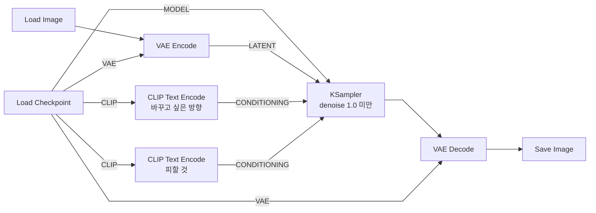
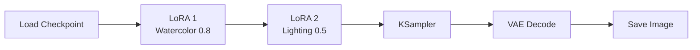

[문서 지도](../README.md)

# 실전 워크플로우 모음

> 다양한 상황별 ComfyUI 워크플로우 예제

## 이 장에서 배우는 것

- 바로 사용하는 예제 모음입니다. 목적에 맞는 워크플로우를 복사해 값만 바꿔 사용합니다.
- 이 장은 기본 Text-to-Image, Image-to-Image, LoRA 스타일 적용 세 가지입니다. 업스케일과 배치 생성은 다음 장에 있습니다.

<div class="guide-meta" markdown>
**대상** 이론보다는 실제 "돌아가는 예제"가 필요한 사용자 · **사전 이해** ComfyUI 노드 추가/연결 방법 · **시간** 30분

**이럴 때 읽으세요** 이론 말고 바로 돌아가는 예제가 필요할 때.
</div>

## 이 문서의 범위

실전에서 자주 사용하는 ComfyUI 워크플로우를 모았습니다.

---

## 목차

1. [기본 Text-to-Image](#1-기본-text-to-image)
2. [Image-to-Image](#2-image-to-image)
3. [LoRA 스타일 적용](#3-lora-스타일-적용)

업스케일과 배치 생성은 [다음 장](upscale-and-batch.md)에 있습니다.

---

## 1. 기본 Text-to-Image

### 목적
프롬프트만으로 새 이미지 생성

> 이 구성은 바로 열 수 있는 파일이 있습니다 → [기본 Text-to-Image 템플릿](../examples/basic-text-to-image/README.md)

### 워크플로우

<div class="workflow-figure" markdown>

[](../assets/images/basic-workflow.svg)

<p class="workflow-figure__caption">기본 7노드 연결도. 이미지를 선택하면 원본 크기로 볼 수 있습니다.</p>

</div>

### 설정 예시

**프롬프트:**
```
Positive: 
a beautiful sunset over mountains,
vibrant colors, dramatic lighting,
high quality, detailed, 8k

Negative:
blurry, low quality, distorted,
watermark, text
```

**설정:**
```
Size: 512×512 (SD 1.5) or 1024×1024 (SDXL)
Steps: 25~30
CFG: 6~7
Sampler: euler or dpmpp_2m
```

처음이라면 [빠른 시작의 모델별 시작값](../00-getting-started/quick-start.md#4-첫-실행값-넣기)을 그대로 사용하세요.

### 활용

컨셉 아트, 아이디어 스케치, 빠른 프로토타입에 사용합니다.

---

## 2. Image-to-Image

### 목적
기존 이미지를 수정하거나 스타일 변경

### 워크플로우



기본 구성과 다른 점은 **앞에 Load Image + VAE Encode가 붙고, denoise를 1.0보다 낮춘다**는 두 가지입니다.

### 설정 예시

**Denoise 강도:**

| 값 | 결과 |
|---|---|
| 0.3-0.4 | 색감·조명 정도만 바뀝니다 |
| 0.5-0.7 | 스타일이 바뀝니다. 여기서 시작하세요 |
| 0.8-0.9 | 원본 구조가 거의 남지 않습니다 |

**프롬프트:**
```
Positive:
[원하는 스타일], based on reference,
maintain composition, high quality

Negative:
deformed, distorted, low quality
```

### 활용

스타일 변환(사진 → 그림), 색감 조정, 디테일 개선에 사용합니다.

---

## 3. LoRA 스타일 적용

### 목적
특정 스타일이나 화풍 추가

### 워크플로우



로더는 `Load LoRA (Model and CLIP)`을 사용합니다([LoRA 가이드](../03-advanced-techniques/lora/README.md#comfyui에서-사용하기)).

### 설정 예시

**LoRA 조합:**
1. **스타일 LoRA** (0.7~0.9) — 수채화, 유화, 애니메이션 등
2. **보조 LoRA** (0.4~0.6) — 조명, 디테일, 분위기 등

**프롬프트 작성:**
```
LoRA 스타일과 일치하는 키워드 사용
예: 수채화 LoRA + "watercolor painting"
```

### 활용

일관된 스타일 유지, 브랜드 아이덴티티, 시리즈 작업에 사용합니다.

---

## 완료 기준

세 가지를 모두 만족했다면 이 장을 끝냈습니다.

- 기본 Text-to-Image 위에 노드를 추가해 Image-to-Image 구성을 만들었다.
- Denoise 값을 바꿔 원본이 얼마나 남는지 확인했다.
- LoRA 로더를 끼워 화풍을 바꿔 봤다.

## 다음 단계

- [업스케일과 배치 생성](upscale-and-batch.md) — 크기 키우기와 여러 장 만들기
- [첫 워크플로우 직접 만들기](../00-getting-started/first-workflow.md) — 예제를 넘어 스스로 구성하기
- [LoRA 기본](../03-advanced-techniques/lora/README.md) — 화풍 적용
- [문제 해결](../05-troubleshooting/README.md) — 실행 실패 진단

---

[문서 지도](../README.md)
