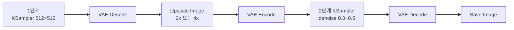
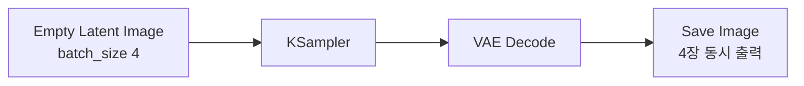

[문서 지도](../README.md)

# 업스케일과 배치 생성

> 만든 이미지를 크게 키우고, 한 번에 여러 장을 만드는 구성입니다.

## 이 장에서 배우는 것

- 크기만 키우는 단계와 디테일을 채우는 단계를 나누는 이유
- 2단계 업스케일에서 denoise를 정하는 기준
- `batch_size`를 올릴 때 늘어나는 것과 주의할 점

<div class="guide-meta" markdown>
**대상** 기본 워크플로우 세 가지를 만들어 본 사용자 · **사전 이해** [워크플로우 예제](README.md)의 Image-to-Image 구성 · **시간** 15분

**이럴 때 읽으세요** 결과물을 인쇄·게시용 크기로 키우거나, 여러 후보를 한 번에 뽑고 싶을 때.
</div>

## 1. 고해상도 업스케일

작은 이미지를 두 단계로 나눠 키웁니다. 한 번에 큰 크기로 생성하면 학습 해상도를 크게 벗어나 구조가 무너집니다.

### 2단계 구성



`Upscale Image`는 크기만 키웁니다. 늘어난 픽셀을 실제 묘사로 채우는 것은 2단계 KSampler의 낮은 denoise 샘플링입니다.

### 값 고르기

`Upscale Image`의 `upscale_method`:

| 값 | 결과 |
|---|---|
| `lanczos` | 경계가 또렷하게 남습니다. 일반적인 사진·일러스트 |
| `bilinear` | 경계가 부드럽게 번집니다 |
| `nearest-exact` | 픽셀 경계를 그대로 유지합니다. 픽셀아트 |

2단계 KSampler의 `denoise`:

| 값 | 결과 |
|---|---|
| 0.3 | 확대된 이미지를 거의 그대로 다듬습니다 |
| 0.4-0.5 | 디테일이 채워집니다. 여기서 시작하세요 |
| 0.6 이상 | 원본의 구조가 남지 않고 다른 그림이 됩니다 |

---

## 2. 배치 생성

같은 설정으로 여러 장을 한 번에 만들어 그중에서 고릅니다.

### 연결



`batch_size`만 올리면 나머지 연결은 그대로입니다. 한 번 실행에 4장이 나옵니다.

### 값 고르기

`Empty Latent Image`의 `batch_size`:

| 값 | 조건 |
|---|---|
| 1 | 기본 |
| 4 | 메모리에 여유가 있을 때 |
| 8 | VRAM 12GB 이상 |

**Seed 설정:**
```
control_after_generate=randomize: 실행 뒤 다음 Seed를 무작위로 변경
control_after_generate=fixed: 같은 Seed와 설정을 유지해 같은 배치를 다시 비교
```

### 주의사항

```
- batch_size를 올린 만큼 VRAM 사용량이 함께 늘어납니다
- 위 표의 VRAM 조건을 넘기면 OOM으로 실행이 멈춥니다
- 한 장이 되는지 먼저 확인한 뒤 batch_size를 올립니다
```

---

??? note "워크플로우 조합 팁 — 실전 프로젝트 흐름"
    ### 실전 프로젝트 흐름

    **1. 컨셉 단계**
    기본 Text-to-Image + Batch 생성(여러 옵션) → 최적 결과 선택

    **2. 스타일 적용**
    선택된 이미지 + Image-to-Image + LoRA 스타일 → 원하는 느낌 완성

    **3. 최종 마무리**
    완성된 이미지 + 고해상도 업스케일 + 디테일 보강 → 최종 결과물

## 완료 기준

세 가지를 모두 만족했다면 이 장을 끝냈습니다.

- 업스케일 2단계를 구성해 크기를 키우고 디테일을 채웠다.
- 2단계 denoise를 바꿔 원본이 얼마나 유지되는지 확인했다.
- 배치 생성 시 VRAM이 얼마나 더 필요한지 직접 확인했다.

## 다음 단계

- [SDXL 해상도 최적화](../02-models/sd-sdxl/resolution-optimization.md) — 어떤 크기로 만들지 정하기
- [제어 기법 실전 워크플로우](../03-advanced-techniques/controlnet/example-workflows.md) — 구조 제어와 조합
- [문제 해결](../05-troubleshooting/README.md) — OOM과 속도 문제

---

[문서 지도](../README.md) · [워크플로우 예제](README.md)
